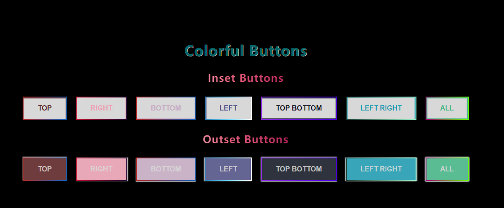

# 前端 CSS : 2# 纯 CSS 实现多彩的 Buttons(box-shadow)
## 介绍
> [box-shadow](https://developer.mozilla.org/zh-CN/docs/Web/CSS/box-shadow) 介绍
>
> [中国色](http://zhongguose.com/)
>
> 感謝 [comehope](https://segmentfault.com/u/comehope) 大佬的 [前端每日实战](https://segmentfault.com/blog/comehope) 对我的启蒙

已经有了 100+ 的练习, 但这种练习并非刻意针对自己薄弱的问题, 而且对于一些概念还处于 -- `"哦, 啊哈, 我懂了(其实并不懂)"` 这种自欺欺人的状态

所以也确定了一下我要总结区别于 `comehope` 大佬总体的练习, 多篇文章会强化某一个属性

`box-shadow` 第一篇 

## 效果预览



> [github.io 浏览](https://shanyuhai123.github.io/learnCSS/0163-colorful-button/)

## 源代码地址

https://github.com/shanyuhai123/learnCSS/tree/master/0163-colorful-button

## 代码解读

首先完成 `html` 结构

```html
<article>
  <h1>colorful buttons</h1>
  <section class="buttons buttons_inset">
    <h2>inset buttons</h2>
    <button class="button button_top">top</button>
    <button class="button button_right">right</button>
    <button class="button button_bottom">bottom</button>
    <button class="button button_left">left</button>
    <button class="button button_tb">top bottom</button>
    <button class="button button_lr">left right</button>
    <button class="button button_all">all</button>
  </section>
  <section class="buttons buttons_outset">
    <h2>outset buttons</h2>
    <button class="button button_top">top</button>
    <button class="button button_right">right</button>
    <button class="button button_bottom">bottom</button>
    <button class="button button_left">left</button>
    <button class="button button_tb">top bottom</button>
    <button class="button button_lr">left right</button>
    <button class="button button_all">all</button>
  </section>
</article>
```

完成标题的 样式 

```css
body {
  margin: 0;
  height: 100vh;
  font: normal 1em, sans-serif;
  display: flex;
  align-items: center;
  justify-content: center;
  background-color: black;
}

h1,
h2 {
  letter-spacing: 1px;
  text-align: center;
  text-transform: capitalize;
  user-select: none;
}
h1 {
  font-size: 2em;
  color: #066;
  text-shadow: 1px 1px rgba(255, 255, 255, 0.7);
}
h2 {
  background: linear-gradient(45deg, #dbdcd7 0%, #dddcd7 24%, #e2c9cc 30%, #e7627d 46%, #b8235a 59%, #801357 71%, #3d1635 84%, #1c1a27 100%);
  -webkit-background-clip: text;
  -webkit-text-fill-color: transparent;
}
```

接着将全部按钮 `button` 设置初始样式

```css
.button {
  font-size: 16px;
  font-weight: 700;
  color: white; /* default */
  text-transform: uppercase;
  background: #d8d8d8;
  border: 2px solid;
  outline: none;
  padding: 1em 2em;
  margin: 0.5em;
  cursor: pointer;
  transition: all .6s, color .3s .4s;
}
.button:hover {
  color: #d8d8d8;
}
```

添加 `box-shadow` 的 `inset` 动画

```css
.button_top {
  color: #5c2223;
  border-image: linear-gradient(to right, #b92b27, #1565c0) 1 1;
  box-shadow: inset 0 2px 1px 0;
}
.button_top:hover {
  box-shadow: inset 0 4em 1px 0 #5c2223;
}

.button_right {
  color: #eba0b3;
  border-image: linear-gradient(to right, #c31432, #240b36) 1 1;
  box-shadow: inset -2px 0 1px 0;
}
.button_right:hover {
  box-shadow: inset -8em 0 1px 0 #eba0b3;
}

.button_bottom {
  color: #c8adc4;
  border-image: linear-gradient(to right, #b92b27, #1565c0) 1 1;
  box-shadow: inset 0 -2px 1px 0;
}
.button_bottom:hover {
  box-shadow: inset 0 -4em 1px 0 #c8adc4;
}

.button_left {
  color: #525288;
  border-image: linear-gradient(to right, #2980b9, #6dd5fa, #ffffff) 1 1;
  box-shadow: inset 2px 0 1px 0;
}
.button_left:hover {
  box-shadow: inset 8em 0 1px 0 #525288;
}

.button_tb {
  color: #131824;
  border-image: linear-gradient(to right, #8e2de2, #4a00e0) 1 1;
  box-shadow: 
    inset 0 2px 1px 0,
    inset 0 -2px 1px 0;
}
.button_tb:hover {
  box-shadow: 
    inset 0 4em 1px 0 #131824,
    inset 0 -4em 1px 0 #131824;
}

.button_lr {
  color: #1e9eb3;
  border-image: linear-gradient(to right, #1f4037, #99f2c8) 1 1;
  box-shadow: 
    inset 2px 0 1px 0,
    inset -2px 0 1px 0;
}
.button_lr:hover {
  box-shadow: 
    inset 8em 0 1px 0 #1e9eb3,
    inset -8em 0 1px 0 #1e9eb3;
}

.button_all {
  color: #45b787;
  border-image: linear-gradient(to right, #a80077, #66ff00) 1 1;
  box-shadow: 
    inset 0 2px 1px 0,
    inset 0 -2px 1px 0,
    inset 2px 0 1px 0,
    inset -2px 0 1px 0;
}
.button_all:hover {
  box-shadow: 
    inset 0 4em 1px 0 #45b787,
    inset 0 -4em 1px 0 #45b787,
    inset 8em 0 1px 0 #45b787,
    inset -8em 0 1px 0 #45b787;
}
```

再添加 `box-shadow` 的 `outset` 动画

```css
.buttons_outset .button {
  animation: 2s ease-in-out infinite;
}
.buttons_outset .button_top {
  animation-name: shaking-top;
}
.buttons_outset .button_right {
  animation-name: shaking-right;
}
.buttons_outset .button_bottom {
  animation-name: shaking-bottom;
}
.buttons_outset .button_left {
  animation-name: shaking-left;
}
.buttons_outset .button_tb {
  animation-name: shaking-tb;
}
.buttons_outset .button_lr {
  animation-name: shaking-lr;
}
.buttons_outset .button_all {
  animation-name: shaking-all;
}

@keyframes shaking-top {
  50% {
    color: #d8d8d8;
    box-shadow: 0 -2px 1px 0;
    background: #5c2223;
  }
}
@keyframes shaking-right {
  50% {
    color: #d8d8d8;
    box-shadow: 2px 0 1px 0;
    background: #eba0b3;
  }
}
@keyframes shaking-bottom {
  50% {
    color: #d8d8d8;
    box-shadow: 0 2px 1px 0;
    background: #c8adc4;
  }
}
@keyframes shaking-left {
  50% {
    color: #d8d8d8;
    box-shadow: -2px 0 1px 0;
    background: #525288;
  }
}
@keyframes shaking-tb {
  50% {
    color: #d8d8d8;
    box-shadow:
      0 -2px 1px 0,
      0 2px 1px 0;
    background: #131824;
  }
}
@keyframes shaking-lr {
  50% {
    color: #d8d8d8;
    box-shadow:
      -2px 0 1px 0,
      2px 0 1px 0;
    background: #1e9eb3;
  }
}
@keyframes shaking-all {
  50% {
    color: #d8d8d8;
    box-shadow:
      0 -2px 1px 0,
      0 2px 1px 0,
      -2px 0 1px 0,
      2px 0 1px 0;
    background: #45b787;
  }
}
```

## 最后

我果然缺乏审美, 自己做的好丑

-----

欢迎大佬补充对 `box-shadow` 属性的用法

指出我在书写中的不规范及更好的写法