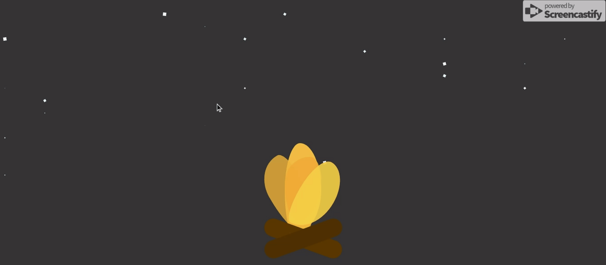

# 前端 CSS : 4# 纯 CSS 实现暖暖的小火堆

## 介绍

> [原文链接](https://codepen.io/thomas-epps/pen/yGVNzR)
>
> 感謝 [comehope](https://segmentfault.com/u/comehope) 大佬的 [前端每日实战]

## 效果预览



> [github.io 浏览](https://shanyuhai123.github.io/learnCSS/0165-firewood-stack/)

## 源代码地址

https://github.com/shanyuhai123/learnCSS/tree/master/0165-firewood-stack

## 代码解读

### 1. 首先是完成 `html` 结构

```html
<figure class="container">
  <section class="stars"></section>
  <section class="fires"></section>
</figure>
```

常规样式初始化

```css
* {
  margin: 0;
  padding: 0;
}

body {
  margin: 0;
  padding: 0 0.5vw;
  height: 100vh;
  background-color: #333;
  overflow: hidden;
}

.container {
  display: flex;
  flex-direction: column;
  align-items: center;
  justify-content: center;
}
```

### 2. 天上的星星

原文中星星是固定位置并且不会闪烁的

而这里我们将会改变这一状态, 而且为了避免重复手动给星星固定位置及大小, 所以采用了 d3 库来减少麻烦

```html
<script src="https://d3js.org/d3.v5.min.js"></script>
```

首先将 `.stars` 改为 grid 布局 

使用 span 标签 作为星星

因为星星要分时间闪烁所以随机一个 `--delay` 参数

```javascript
// index.js
const COLUMNS = 15;

d3.select('.stars')
  .style('--columns', COLUMNS)
  .selectAll('span')
  .data(d3.range(COLUMNS * COLUMNS))
  .enter()
  .append('span')
  .style('--delay', () => Math.random() * 20);
```

先给出大概的范围, 查看下边界

```css
.stars {
  width: 99vw;
  height: 70vh;
  position: absolute;
  display: grid;
  grid-template-columns: repeat(var(--columns), 1fr);
  border: 1px solid;
}

.stars span {
  width: 0.6vw;
  height: 0.6vw;
  color: whitesmoke;
  background-color: currentColor;
}
```

星星现在只是一个个正方形, 再给正方形添加上旋转闪现的动画即可

```css
.stars span {
  transform: scale(0);
  animation: spin 20s linear infinite;
  animation-delay: calc(var(--delay) * 1s);
}

@keyframes spin {
  0% {
    transform: rotate(0deg) scale(1);
  }

  5%,
  15% {
    transform: rotate(90deg) scale(0);
    background: goldenrod;
  }

  17.5% {
    transform: rotate(180deg) scale(1);
    background-color: currentColor;
  }

  20%,
  100% {
    transform: rotate(90deg) scale(0);
  }
}
```

### 3. 添加火堆

首先是修改 DOM

```html
<section class="fires">
  <span class="fires__flame"></span>
  <span class="fires__flame"></span>
  <span class="fires__flame"></span>
  <span class="fires__flame"></span>
  <span class="fires__stick"></span>
  <span class="fires__stick"></span>
</section>
```

使火堆居中, 利用媒体查询改变一下在手机端偏小的问题

```css
.fires {
  position: relative;
  border: 1px solid;
}

@media screen and (min-width: 451px) {
  .fires {
    width: 15vw;
    height: 15vw;
    margin-top: -7vw;
  }
}
@media screen and (max-width: 450px) {
  .fires {
    width: 18vh;
    height: 18vh;
    margin-top: -5vw;
  }
}
```

接着完成火焰效果, 在父级添加可用的 `color` , `border-radius` 变量

```css
.fires {
  position: relative;
  display: flex;
  align-items: center;
  justify-content: center;
  border: 1px solid;
  --color-one: #D92B29;
  --color-two: #F5732A;
  --color-three: #F2B338;
  --color-four: #F5D549;
  --shape-one: 79% 21% 64% 36% / 43% 61% 39% 57%;
  --shape-two: 23% 77% 66% 34% / 57% 72% 28% 43%;
  --shape-three: 78% 22% 63% 37% / 39% 27% 73% 61%;
  --shape-four: 35% 65% 78% 22% / 54% 50% 50% 46%;
}

@media screen and (min-width: 451px) {
  .fires__flame {
    width: 6vw;
  }
  .fires__flame:nth-of-type(1) {
    height: 15vw;
  }
  .fires__flame:nth-of-type(2) {
    height: 12vw;
    transform: translate(2.25vw, 1.2vw) rotate(30deg);
  }
  .fires__flame:nth-of-type(3) {
    height: 13.5vw;
    transform: translate(-2.25vw, 1.2vw) rotate(-30deg);
  }
  .fires__flame:nth-of-type(4) {
    height: 10.5vw;
  }
}
@media screen and (max-width: 450px) {
  .fires__flame {
    width: 7.2vh;
  }
  .fires__flame:nth-of-type(1) {
    height: 18vh;
  }
  .fires__flame:nth-of-type(2) {
    height: 14.4vh;
    transform: translate(2.7vh, 1.44vh) rotate(30deg);
  }
  .fires__flame:nth-of-type(3) {
    height: 16.2vh;
    transform: translate(-2.7vh, 1.44vh) rotate(-30deg);
  }
  .fires__flame:nth-of-type(4) {
    height: 12.6vh;
  }
}

.fires__flame {
  position: absolute;
  background-color: var(--color-one);
  border-radius: var(--shape-one);
  z-index: 0;
  animation-name: fire;
  animation-duration: 1.5s;
  animation-iteration-count: infinite;
  transition: ease 0.4s;
}
.fires__flame:nth-of-type(2) {
  border-radius: var(--shape-two);
  background-color: var(--color-two);
  opacity: 0.9;
  z-index: 2;
  animation-delay: 0.2s;
}
.fires__flame:nth-of-type(3) {
  border-radius: var(--shape-three);
  background-color: var(--color-three);
  opacity: 0.8;
  z-index: 1;
  animation-delay: 0.4s;
}
.fires__flame:nth-of-type(4) {
  border-radius: var(--shape-four);
  background-color: var(--color-four);
  opacity: 0.8;
  z-index: 1;
  animation-delay: 0.6s;
}
```

当然别忘了火焰的动画效果

```css
@keyframes fire {
  0% {
    border-radius: var(--shape-one);
    background-color: var(--color-one);
  }
  25% {
    border-radius: var(--shape-two);
    background-color: var(--color-two);
  }
  50% {
    border-radius: var(--shape-three);
    background-color: var(--color-three);
  }
  75% {
    border-radius: var(--shape-four);
    background-color: var(--color-four);
  }
  100% {
    border-radius: var(--shape-one);
    background-color: var(--color-one);
  }
}
```

再添加木柴

```css
@media screen and (min-width: 451px) {
  .fires__stick {
    border-radius: 1.5vw;
    width: 3vw;
    height: 13.5vw;
    bottom: -7.5vw;
  }
}
@media screen and (max-width: 450px) {
  .fires__stick {
    border-radius: 1.8vh;
    width: 3.6vh;
    height: 16.2vh;
    bottom: -9vh;
  }
}

.fires__stick {
  background-color: #5a3600;
  position: absolute;
  z-index: 2;
  transform:rotate(-70deg);
}
.fires__stick:last-of-type {
  transform:rotate(70deg);
  background-color: #4e2f01;
}
```

### 4. 最后

最后记得把之前确认位置及大小的 border 边框删除即可