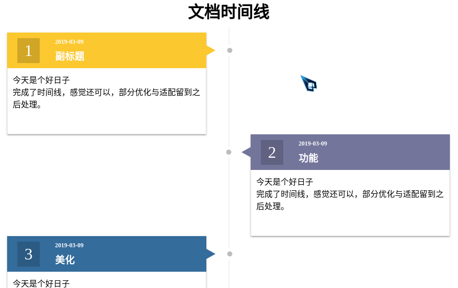

# 前端 CSS : 5# 纯 CSS 实现时间线

## 介绍

刚准备写的时候想着我 CSS 已经熟练了，随便写写应该就差不多了吧，15分钟才写了个半成品，还丑的很，一定是这十来天美誉写 CSS 的原因（甩锅）。

所以还是安安分分的按照套路来吧，先写个 DIV，再把它填充，重复多个……


> 感謝 [comehope](https://segmentfault.com/u/comehope) 大佬的 [前端每日实战]

## 效果预览



> [github.io 浏览](https://shanyuhai123.github.io/learnCSS/0167-timeline/)

## 源代码地址

https://github.com/shanyuhai123/learnCSS/tree/master/0167-timeline

## 代码解读

### 1. 基础的 HTML 结构

```html
<div class="timeline">
  <h1>文档时间线</h1>
  <div class="cards">
    <section class="card"></section>
  </div>
</div>
```

常规样式初始化：

```css
* {
  margin: 0;
  padding: 0;
  box-sizing: border-box;
}

body {
  height: 100vh;
}

h1 {
  text-align: center;
}
```

### 2. 基础 `card` 样式

总体布局的 `timeline` 暂时不用考虑，首先完成 `card` ，之后将多个 `card` 组合时才需要考虑。

`card` 分为两部分 `header` 存放标题，`article` 存放内容详情。

**修改 `DOM` 结构**

```html
<section class="card">
  <header class="card__header">
    <div class="header__number">
      <span>1</span>
    </div>
    <h2 class="header__title">
      <span class="title__date">2019-03-09</span>
      <span class="title__sub">副标题</span>
    </h2>
  </header>
  <article class="card__article">
    <p>今天是个好日子</p>
  </article>
</section>
```

**修改 `card` 样式**

```css
.card {
  position: relative;
  width: 400px;
  height: 200px;
  display: flex;
  flex-direction: column;
  box-shadow: 0px 3px 1px -2px rgba(0,0,0,0.2), 0px 2px 2px 0px rgba(0,0,0,0.14), 0px 1px 5px 0px rgba(0,0,0,0.12);

  /* 观测用，待删除 */
  border: 1px dashed darkorange;
}
```

这样一个基础的 `card` 就实现了。

### 3. 完善 `card` 样式

**header 结构**

```css
.card__header {
  display: flex;
  align-items: center;
  width: 100%;
  height: 35%;
  color: #fff;
  background-color: #134857;
  overflow: hidden;
}
```

**header 内部**

```css
.header__number {
  display: flex;
  align-items: center;
  justify-content: center;
  margin: 0 20px;
  padding: 6px 14px;
  font-size: 2rem;
  background-color: rgba(0,0,0,0.17);
}
.header__title {
  display: flex;
  margin-left: 10px;
  flex-direction: column;
  font-size: 0.6rem;
}
.title__sub {
  padding-top: 6px;
  font-size: 1.2rem;
}
```

**article 结构**

article 初步的想法还是比较简单的：

```css
.card__article {
  width: 100%;
  height: 65%;
  background-color: #fff;
  border: 1px solid rgba(200,200,200,0.5);
  border-top: none;
  padding: 10px;
}
```

### 4. 多个 `card`

**修改 DOM 结构**

在 `.cards` 中增加多个 `card` ，此处仅显示 DOM 结构省略了部分内容。

```html
<div class="timeline">
  <h1>飞越高山与大洋的鱼</h1>
  <div class="cards">
  <section class="card">
    <header class="card__header">
      <div class="header__number">
        <span>1</span>
      </div>
      <h2 class="header__title">
        <span class="title__date">2019-03-09</span>
        <span class="title__sub">副标题</span>
      </h2>
    </header>
    <article class="card__article">
      <p>今天是个好日子</p>
    </article>
  </section>
    <section class="card"></section>
    <section class="card"></section>
    <section class="card"></section>
  </div>
</div>
```

**.cards 时间线**

修改 .`cards` 、`.card` 大小，并利用伪元素增加中间线：

```css
.cards {
  position: relative;
  display: flex;
  flex-direction: column;
  width: 100%;
  height: 100%;
  /* 观测用，待删除 */
  border: 1px solid #000;
}
.cards::after {
  z-index: 9;
  content: "";
  position: absolute;
  top: 0;
  bottom: 0;
  left: 50%;
  border-left: 1px solid rgba(200,200,200,0.5);
}

.card {
  width: 46%;
}
```

**`card` 分列两侧**

```css
.card:nth-child(odd) {
  align-self: flex-start;
}
.card:nth-child(even ) {
  align-self: flex-end;
}
```

**增加三角标识**

利用 header 的伪元素实现

```css
.card:nth-child(odd) .card__header::after {
  position: absolute;
  left: 100%;
  content: "";
  width: 0;
  height: 0;
  border-style: solid;
  border-width: 10px 0 10px 18px;
  border-color: transparent transparent transparent #134857;
}
.card:nth-child(even) .card__header::after {
  position: absolute;
  right: 100%;
  content: "";
  width: 0;
  height: 0;
  border-style: solid;
  border-width: 10px 18px 10px 0;
  border-color: transparent #134857 transparent transparent;
}
```

**中间线上增加标识点**

```css
.card:nth-child(odd) .card__header::before {
  z-index: 10;
  position: absolute;
  left: calc(111.11% - 2.5px);
  content: "";
  width: 10px;
  height: 10px;
  border-radius: 10px;
  background-color: #bdbdbd;
  box-shadow: 0 0 2px 6px #fff;
}
.card:nth-child(even) .card__header::before {
  z-index: 10;
  position: absolute;
  right: calc(111.11% - 5px);
  content: "";
  width: 10px;
  height: 10px;
  border-radius: 10px;
  background-color: #bdbdbd;
  box-shadow: 0 0 2px 6px #fff;
}
```

### 5. 美化

**去除 border 注释**

直接删除即可。

**header 赋予不同颜色**

设置默认色：

```css
:root {
  --bg-color: #10aec2; 
}

.card__header {
  background-color: var(--bg-color);
}
.card:nth-child(odd) .card__header::after {
  border-color: transparent transparent transparent var(--bg-color);
}
.card:nth-child(even) .card__header::after {
  border-color: transparent var(--bg-color) transparent transparent;
}
```

修改为 4 种颜色循环（若想要循环更多颜色增加 n 即可）：

```css
.card:nth-child(4n) {
  --bg-color: #10aec2;
}
.card:nth-child(4n+1) {
  --bg-color: #fbc82f;
}
.card:nth-child(4n+2) {
  --bg-color: #74759b;
}
.card:nth-child(4n+3) {
  --bg-color: #346c9c;
}
```

**修改间隔**

```css
h1 {
  margin-bottom: 10px;
}

.cards {
  padding: 10px 16px;
}
```


## 最后

其实这个只完成了一半，还有进一步适配移动端还未完成，之后会补上。


## 参考资料

1. [取色](http://zhongguose.com)
2. [参考样式](https://vuetifyjs.com/zh-Hans/components/timelines)