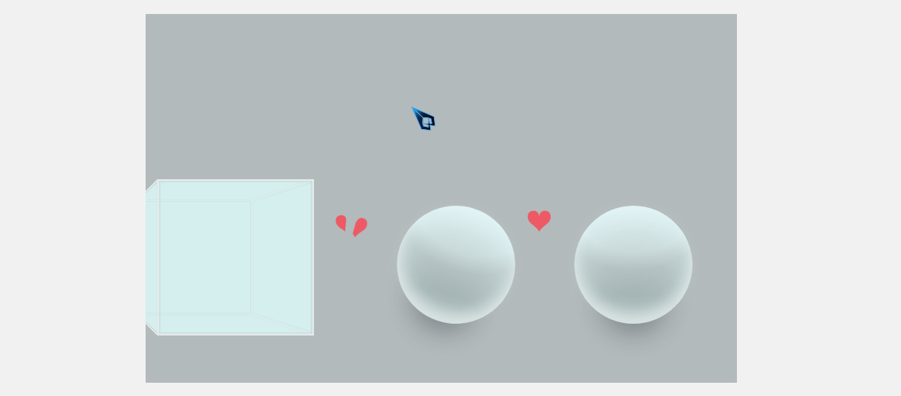
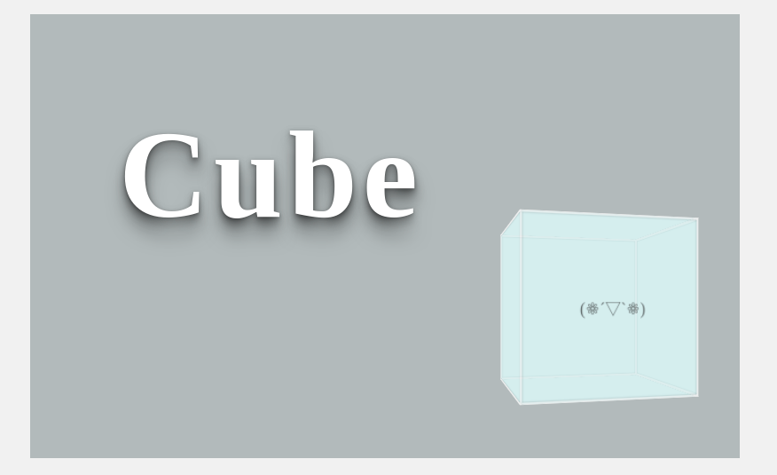
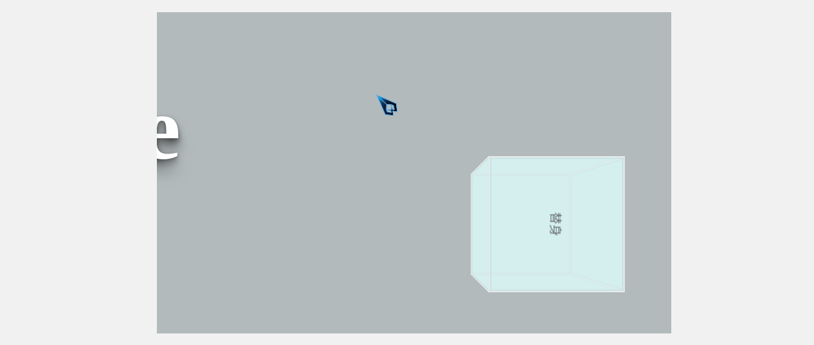
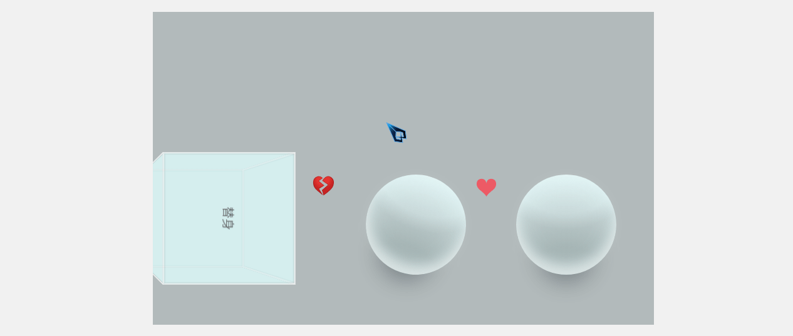
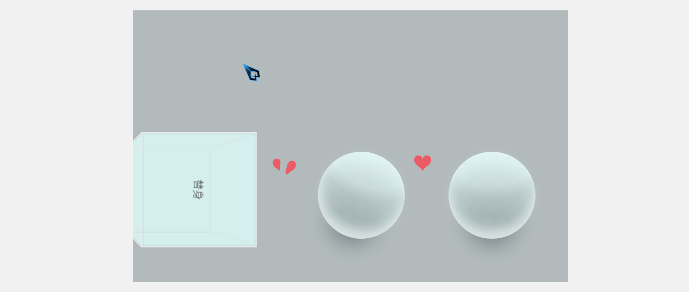

# 前端 CSS : 7# 纯 CSS 实现像极了爱情

## 介绍

最近突然回想到之前看过的一个动画，是一个正方体向球体表示爱意，被拒绝，改变自己的小动画。

找了半天终于找到了，个人感觉是一个很棒的动画，强烈安利：

**[《方块》](https://www.vmovier.com/51909)**


## 效果预览



> [github.io 浏览](https://shanyuhai123.github.io/learnCSS/0168-oh-my-love/)


## 源代码地址

https://github.com/shanyuhai123/learnCSS/tree/master/0168-oh-my-love


## 代码解读

### 1. 导演上场

这个动画中存在镜头转换，所以我们需要一个导演把控全局，写个简单效果进行测试。

场景 `love` 就位，导演 `director` 就位，龙套们 `actors` 就位：

```html
<figure class="love">
  <div class="director">
    <p class="actors">
      丙辰中秋，欢饮达旦，大醉，作此篇，兼怀子由。
      明月几时有？把酒问青天。不知天上宫阙，今夕是何年。我欲乘风归去，又恐琼楼玉宇，高处不胜寒。起舞弄清影，何似在人间？
      转朱阁，低绮户，照无眠。不应有恨，何事长向别时圆？人有悲欢离合，月有阴晴圆缺，此事古难全。但愿人长久，千里共婵娟。
    </p>
    <p class="actors">
      红藕香残玉簟秋。轻解罗裳，独上兰舟。云中谁寄锦书来，雁字回时，月满西楼。
      花自飘零水自流。一种相思，两处闲愁。此情无计可消除，才下眉头，却上心头。
    </p>
  </div>
</figure>
```

场景过于简陋，需要美化升级一下，演员们也要稍微装饰一下：

```css
* {
  margin: 0;
  padding: 0;
  box-sizing: border-box;
}

body {
  position: relative;
  height: 100vh;
  width: 100vw;
  background-color: #f1f1f1;
  overflow: hidden;
}

.love {
  position: absolute;
  top: 50%;
  left: 50%;
  transform: translate(-50%, -50%);
  /* 不定宽高垂直居中推荐 flex，此处玩玩而已 */
  width: 800px;
  height: 500px;
  background-color: #b5bfc0;
  overflow: hidden;
}

.director {
  width: 1200px;
  height: 100%;
  border: 1px dashed red;
  display: flex;
  justify-content: space-between;
}

.actors {
  width: 45%;
  border: 1px solid purple;
}
```

镜头 `len` 准备，导演试机：

```css
.director {
  animation: len 5s linear .2s infinite;
}

@keyframes len {
  from {
    transform: translateX(0);
  }
  to {
    transform: translateX(-400px);
  }
}
```

测试完成。


### 2. 猪脚 `cube` 登场

龙套们退场，猪脚登场。

猪脚要有玉树凌风之姿，一米八的身高配上微微侧身，先来一张猪脚的海报吸引人气吧：


```html
<div class="director">
  <header>
    <h1 class="title">Cube</h1>
  </header>
  <section class="cube">
    <div class="cube__body">
      <div class="cube__face cube__face_front">(❁´▽`❁)</div>
      <div class="cube__face cube__face_back"></div>
      <div class="cube__face cube__face_left"></div>
      <div class="cube__face cube__face_right"></div>
      <div class="cube__face cube__face_top"></div>
      <div class="cube__face cube__face_bottom"></div>
    </div>
  </section>
</div>
```

```css
h1 {
  position: absolute;
  left: 100px;
  top: 100px;
  font-size: 140px;
  letter-spacing: 6px;
  color: #fff;
  user-select: none;
  text-shadow: 0 0 5px rgba(0, 0, 0, .05), 0 1px 3px rgba(0, 0, 0, .2), 0 3px 5px rgba(0, 0, 0, .2), 0 5px 10px rgba(0, 0, 0, .2), 0 10px 10px rgba(0, 0, 0, .2), 0 20px 20px rgba(0, 0, 0, .3);
}

.cube {
  position: absolute;
  left: 540px;
  --size: 180px;
  width: var(--size);
  height: var(--size);
  perspective: 600px;
}

.cube__body {
  position: relative;
  width: inherit;
  height: inherit;
  transform-style: preserve-3d;
  transform: rotateY(15deg);
}

.cube__face {
  position: absolute;
  width: inherit;
  height: inherit;
  opacity: .5;
  display: flex;
  align-items: center;
  justify-content: center;
  color: black;
  background-color: lightcyan;
  border: 2px solid #fff;
  box-shadow: inset 0 0 15px rgba(0, 0, 0, .5);
}

.cube__face_front {
  transform: rotateY(0) translate3d(0, 0, calc(var(--size) / 2));
}

.cube__face_back {
  transform: rotateY(180deg) translate3d(0, 0, calc(var(--size) / 2));
}

.cube__face_left {
  transform: rotateY(-90deg) translate3d(0, 0, calc(var(--size) / 2));
}

.cube__face_right {
  transform: rotateY(90deg) translate3d(0, 0, calc(var(--size) / 2));
}

.cube__face_top {
  transform: rotateX(90deg) translate3d(0, 0, calc(var(--size) / 2));
}

.cube__face_bottom {
  transform: rotateX(-90deg) translate3d(0, 0, calc(var(--size) / 2));
}
```

猪脚表示它并不想吊威亚，那就放它下来吧，试镜发现化的妆也浓了，这张海报不合格：

```css
.love {
  display: flex;
  align-items: flex-end;
  padding-bottom: 80px;
}

.cube__face {
  box-shadow: inset 0 0 2px rgba(0, 0, 0, .5);
}
```

重新拍一张海报，用来宣传：



这样猪脚看起来还是眉清目秀的。

### 3. 替身救场

原本是计划着猪脚两个前滚翻进入下一场景，奈何缺乏动作指导无法实现（求一个动作指导帮帮猪脚），这时候就只能靠替身救场了。

猪脚的前滚翻：

```css
.cube__body {
  animation: woo 2s linear forwards;
}

@keyframes woo {
  0% {
    transform-origin: 100% 100%;
    transform: rotateY(0) rotateZ(0);
  }
  5% {
    transform-origin: 100% 100%;
    transform: rotateY(0) rotateZ(0);
  }
  50% {
    transform-origin: 100% 100%;
    transform: rotateY(0) rotateZ(.25turn);
  }
  99% {
    transform-origin: 100% 100%;
    transform: rotateY(0) rotateZ(.25turn);
  }
  100% {
    transform-origin: 100% 100%;
    transform: rotateY(0) rotateZ(.25turn);
    visibility: hidden;
  }
}
```

替身接替前滚翻：

```html
<section class="substitute">
  <div class="substitute__body">
    <div class="cube__face cube__face_front">替身</div>
    <div class="cube__face cube__face_back"></div>
    <div class="cube__face cube__face_left"></div>
    <div class="cube__face cube__face_right"></div>
    <div class="cube__face cube__face_top"></div>
    <div class="cube__face cube__face_bottom"></div>
  </div>
</section>
```

```css
.substitute__body {
  animation: woo_sub 2s 1.85s linear forwards;
  visibility: hidden;
}
@keyframes woo_sub {
  1% {
    transform-origin: 100% 100%;
    transform: rotateY(0) rotateZ(0);
    visibility: hidden;
  }
  5% {
    transform-origin: 100% 100%;
    transform: rotateY(0) rotateZ(0);
    visibility: hidden;
  }
  50% {
    transform-origin: 100% 100%;
    transform: rotateY(0) rotateZ(.25turn);
    visibility: visible;
  }
  100% {
    transform-origin: 100% 100%;
    transform: rotateY(0) rotateZ(.25turn);
    visibility: visible;
  }
}
```

镜头准备，再一次试镜：



场景长度不够，等下配角们站哪里？赶紧加点预算：

```css
.director {
  width: 1700px;
}

@keyframes len {
  from {
    transform: translateX(0);
  }
  to {
    transform: translateX(-900px);
  }
}
```

### 4. 配角 `sphere` 上场

由于导演全局把控能力太差，所以需要分镜头拍摄：

```css
.director {
  /* animation: len 6s linear .2s forwards; */
  transform: translateX(-900px);
}

.cube__body {
  /* animation: woo 2s 1s linear forwards; */
}
.substitute__body {
  /* animation: woo_sub 2s 2.85s linear forwards; */
}
```

配角们身高一米六，化好妆后登场：

```html
<section class="sphere__wrap">
  <div class="sphere sphere_left"></div>
  <div class="sphere sphere_right"></div>
</section>
```

```css
.sphere__wrap {
  position: absolute;
  bottom: 0;
  right: -840px;
  height: 320px;
  width: 450px;
  display: flex;
  align-items: flex-end;
  justify-content: space-between;
}

.sphere {
  --sphere-size: 160px;
  width: var(--sphere-size);
  height: var(--sphere-size);
  border-radius:50%;
  box-shadow:
    0 3em 2.5em -2.5em rgba(53,64,73,.6),
    0 0 1em -0.35em rgba(255,255,255,.2),
    0 -1em 1.1em 0 rgba(255,255,255,.5) inset,
    0 0 2.5em 0 rgba(227,249,250,.4) inset;
  background:
    radial-gradient(circle at 33% -25%,rgba(227,249,250,0) 40%,rgba(0, 0, 0,.07) 50%),
    radial-gradient(circle at 50% 135%, rgba(0, 0, 0,.23) 43%,rgba(227,249,250,0)),
    radial-gradient(circle at 50% -35%, rgba(227,249,250,.8) 45%,rgba(227,249,250,0)),
    radial-gradient(circle at 50% 0, #fff,lightcyan);
  background-size: 150%, 100%, 100%, 100%;
}
```

喂，身为一个演员动作要丰富，不是让你站着当花瓶的：

```css
.sphere_left {
  animation: move 1s ease-in forwards;
}
@keyframes move {
  to {
    transform: translateX(50px) rotate(.05turn);
  }
}
```

还要有丰富的感情，你以为是小鲜肉面无表情就可以吗：

```css
.love {
  --color-love: #ed5a65;
}

.sphere_left::after {
  content: "❤";
  font-size: 42px;
  color: var(--color-love);
  position: absolute;
  top: 0;
  right: 0;
  transform: scale(0);
  animation: love_gen 1s .8s linear forwards;
}

@keyframes love_gen {
  from {
    transform: scale(0) translate(0, 0);
  }
  to {
    transform: scale(1) translate(25px, -40px) rotate(-.05turn);
  }
}
```

OK，试镜：


看起来还不错，下一个镜头。

### 5. 猪脚示爱

配角们的镜头拍完了，还需要补拍猪脚示爱的镜头，这时候就要展现猪脚炸裂的演技了，从示爱到心碎：

```css
.substitute__body::after {
  content: "❤";
  font-size: 30px;
  color: var(--color-love);
  position: absolute;
  top: 0;
  right: 0;
  transform: scale(0);
  animation: love_vip 5s 4s linear forwards;
}

@keyframes love_vip {
  0% {
    transform: scale(0) translate(-100px, -200px);
  }
  10%, 80% {
    transform: scale(1) translate(-125px, -110px) rotate(-.25turn);
  }
  100% {
    content: "💔";
    transform: scale(1) translate(-125px, -110px) rotate(-.25turn);
  }
}
```

试镜：



敬业的猪脚对这个效果不满意，要求重拍：

```html
<span class="heart" data-text="❤">❤</span>
```

```css
.heart {
  font-size: 40px;
  color: transparent;
  position: absolute;
  top: 0;
  left: 0;
  user-select: none;
  transform: translate(50px, -50px) rotate(-.25turn) scale(0);
  animation: love_vip 5s 4s linear forwards;
}
.heart::before,
.heart::after {
  position: absolute;
  content: attr(data-text);
  top: 0;
  left: 0;
  color: var(--color-love);
}
.heart::before {
  clip-path: polygon(0 0, 60% 0, 30% 100%, 0 100%);
  animation: love_broken_left 1s 8s linear forwards;
}
.heart::after {
  clip-path: polygon(60% 0, 100% 0, 100% 100%, 30% 100%);
  animation: love_broken_right 1s 8s linear forwards;
}

@keyframes love_vip {
  0% {
    transform: scale(0) translate(50px, -50px) rotate(-.25turn);
  }
  20%, 80% {
    transform: scale(1) translate(10px, -125px) rotate(-.25turn);
  }
  100% {
    transform: scale(1) translate(30px, -125px) rotate(-.25turn);
  }
}
@keyframes love_broken_left {
  to {
    left: -.15em;
    transform: rotate(-5deg);
    top: -0.05em;
  }
}
@keyframes love_broken_right {
  to {
    left: .15em;
    transform: rotate(5deg);
    top: 0.05em;
  }
}
```

试镜：



好了，这一幕可以过了。

### 6. 猪脚失恋

导演：你要充分表现这个失恋的情绪：哀伤、自闭、最后化成一堆碎片……

猪脚：我是谁，我在哪……

旁白：敬业的猪脚因完成不了导演的要求，选择离开潜心学习表演技巧，并表示因为自己演技不够所以不要这份报酬了……

### 7. 预告版

投资商作为猪脚的亲爹，表示相信猪脚一定可以锻炼好演技，于是请了百万后期来修整一下片子作为预告版吸引人气，并宣称延期发布正式版（预告版请上翻到效果预览处），这一部分过多修改，具体请看源代码地址。


## 最后

友情提示：CSS 虽然很有意思，但还是推荐重心放在 JavaScript 上。


## 参考资料

1. [取色](http://zhongguose.com)