# learnCSS
该库用来学习 CSS

## 来源

**[comehope](https://github.com/comehope)/[front-end-daily-challenges](https://github.com/comehope/front-end-daily-challenges)**

## 介绍

是非常赞`CSS`的示例

我相信如果能跟着做下来一定会有非常大的进步

就像作者说的那般 

> Challenge yourself each day!  

---

2018.09.03

新增了 `0000` 文件夹用来解释 `css` 的各个属性,加深自己对其的理解

## 待办

- [ ] 针对 `0000` 文件夹中的每个属性一些拓展性的用法 

## 效果列表

### 0001. Button text staggered sliding effects

**原文链接 :** [github](https://github.com/comehope/front-end-daily-challenges/tree/master/001-button-text-staggered-sliding-effects) 

**介绍 :**  按钮文字滑动特效

**效果 :**

**链接 :** [github](https://shanyuhai123.github.io/learnCSS/0001-button-text-staggered-sliding-effects/)

### 0002. Rectangular rotating loader animation

**原文链接 :** [github](https://github.com/comehope/front-end-daily-challenges/tree/master/002-rectangular-rotating-loader-animation)

**介绍 :**  矩形旋转 `loader` 特效

**效果 :**

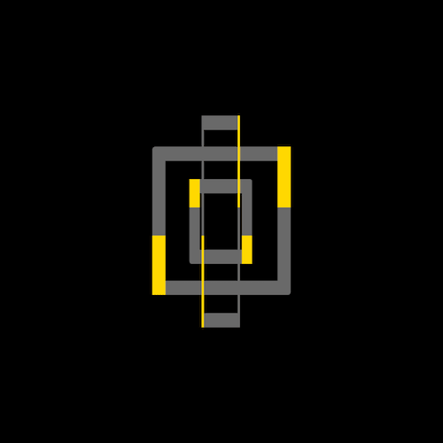

**链接 :** [github](https://shanyuhai123.github.io/learnCSS/0002-rectangular-rotating-loader-animation/)

### 0003. Diagonal stripe border effects

**原文链接 :** [github](https://github.com/comehope/front-end-daily-challenges/tree/master/003-diagonal-stripe-border-effects)

**介绍 :**  容器厚条纹边框特效

**效果 :**

**链接 :** [github](https://shanyuhai123.github.io/learnCSS/0003-diagonal-stripe-border-effects/)

### 0004. Metallic glossy 3d button effects

**原文链接 :** [github](https://github.com/comehope/front-end-daily-challenges/tree/master/004-metallic-glossy-3d-button-effects)

**介绍 :**  金属光泽 3D 按钮特效

**效果 :**

 

**链接 :** [github](https://shanyuhai123.github.io/learnCSS/0004-metallic-glossy-3d-button-effects/)

### 0005. Sleek sliding toggle checkbox

**原文链接 :** [github](https://github.com/comehope/front-end-daily-challenges/tree/master/005-sleek-sliding-toggle-checkbox)

**介绍 :**  立体滑动 toggle 交互控件

**效果 :**

 

**链接 :** [github](https://shanyuhai123.github.io/learnCSS/0005-sleek-sliding-toggle-checkbox/)

### 0006. Blue dazzling diamond

**原文链接 :** [github](https://github.com/comehope/front-end-daily-challenges/tree/master/006-blue-dazzling-diamond)

**介绍 :**  闪闪发光的璀璨钻石

**效果 :**

 

**链接 :** [github](https://shanyuhai123.github.io/learnCSS/0006-blue-dazzling-diamond/)

### 0007. 3d text marquee effects

**原文链接 :** [github](https://github.com/comehope/front-end-daily-challenges/tree/master/007-3d-text-marquee-effects)

**介绍 :**  3D 文字跑马灯特效

**效果 :**

 

**链接 :** [github](https://shanyuhai123.github.io/learnCSS/0007-3d-text-marquee-effects/)

### 0008. Charging loader animation

**原文链接 :** [github](https://github.com/comehope/front-end-daily-challenges/tree/master/008-charging-loader-animation#charging-loader-animation)

**介绍 :**  充电 loader 特效

**效果 :**

 

**链接 :** [github](https://shanyuhai123.github.io/learnCSS/0008-charging-loader-animation/)

### 0009. Aimed button effects

**原文链接 :** [github](https://github.com/comehope/front-end-daily-challenges/tree/master/009-aimed-button-effects)

**介绍 :**  按钮被瞄准的交互特效

**效果 :**

 

**链接 :** [github](https://shanyuhai123.github.io/learnCSS/0009-aimed-button-effects/)

### 0010. Concentric arc rotating loader animation

**原文链接 :** [github](https://github.com/comehope/front-end-daily-challenges/tree/master/010-concentric-arc-rotating-loader-animation)

**介绍 :**  同心圆弧旋转 loader 特效

**效果 :**

 

**链接 :** [github](https://shanyuhai123.github.io/learnCSS/0010-concentric-arc-rotating-loader-animation/)

### 0011. Ripple pulse loader animation

**原文链接 :** [github](https://github.com/comehope/front-end-daily-challenges/tree/master/011-ripple-pulse-loader-animation)

**介绍 :**  荧光脉冲 loader 特效

**效果 :**

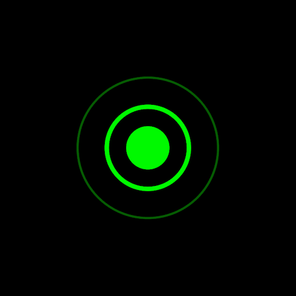 

**链接 :** [github](https://shanyuhai123.github.io/learnCSS/0011-ripple-pulse-loader-animation/)

### 0012. Broken text effects

**原文链接 :** [github](https://github.com/comehope/front-end-daily-challenges/tree/master/012-broken-text-effects)

**介绍 :**  文字断开的交互特效

**效果 :**

 

**链接 :** [github](https://shanyuhai123.github.io/learnCSS/0012-broken-text-effects/)

### 0013. Hot coffee cup

**原文链接 :** [github](https://github.com/comehope/front-end-daily-challenges/tree/master/013-hot-coffee-cup)

**介绍 :**  冒着热气的咖啡杯

**效果 :**

 

**链接 :** [github](https://shanyuhai123.github.io/learnCSS/0013-hot-coffee-cup/)

### 0014. Three languages for web development

**原文链接 :** [github](https://github.com/comehope/front-end-daily-challenges/tree/master/014-three-languages-for-web-development)

**介绍 :**  侧立图书的特效

**效果 :**

 

**链接 :** [github](https://shanyuhai123.github.io/learnCSS/0014-three-languages-for-web-development/)

### 0015. Development skills card

**原文链接 :** [github](https://github.com/comehope/front-end-daily-challenges/tree/master/015-development-skills-card)

**介绍 :**  条形图，不用任何图表库

**效果 :**

 

**链接 :** [github](https://shanyuhai123.github.io/learnCSS/0015-development-skills-card/)

### 0016. Colorful gradient animated border

**原文链接 :** [github](https://github.com/comehope/front-end-daily-challenges/tree/master/016-colorful-gradient-animated-border)

**介绍 :**  渐变色动画边框

**效果 :**

 

**链接 :** [github](https://shanyuhai123.github.io/learnCSS/0016-colorful-gradient-animated-border/)

### 0017. Swapping colors loader animation

**原文链接 :** [github](https://github.com/comehope/front-end-daily-challenges/tree/master/017-swapping-colors-loader-animation)

**介绍 :**  炫酷的同心矩形旋转动画

**效果 :**

 

**链接 :** [github](https://shanyuhai123.github.io/learnCSS/0017-swapping-colors-loader-animation/)

### 0018. Stroke morphing 404 effects

**原文链接 :** [github](https://github.com/comehope/front-end-daily-challenges/tree/master/018-stroke-morphing-404-effects)

**介绍 :**  404 文字变形为 NON 文字的交互特效

**效果 :**

 

**链接 :** [github](https://shanyuhai123.github.io/learnCSS/0018-stroke-morphing-404-effects/)

### 0019. Split text menu effects

**原文链接 :** [github](https://github.com/comehope/front-end-daily-challenges/tree/master/019-split-text-menu-effects)

**介绍 :**  削铁如泥感觉的菜单导航特效

**效果 :**

**链接 :** [github](https://shanyuhai123.github.io/learnCSS/0019-split-text-menu-effects/)

### 0020. Pixel animation heart shape

**原文链接 :** [github](https://github.com/comehope/front-end-daily-challenges/tree/master/020-pixel-animation-heart-shape)

**介绍 :**  为母亲节创作一颗像素画风格的爱心

**效果 :**

**链接 :** [github](https://shanyuhai123.github.io/learnCSS/0020-pixel-animation-heart-shape/)

### 0021. A text sliding effect UI

**原文链接 :** [github](https://github.com/comehope/front-end-daily-challenges/tree/master/021-a-text-sliding-effect-ui)

**介绍 :**  文本滑动特效的 UI 界面

**效果 :**

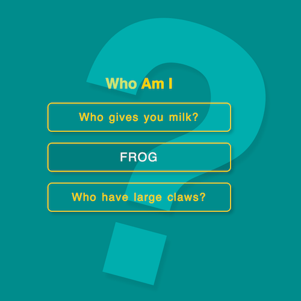

**链接 :** [github](https://shanyuhai123.github.io/learnCSS/0021-a-text-sliding-effect-ui/)

### 0022. Stripy rainbow text effects

**原文链接 :** [github](https://github.com/comehope/front-end-daily-challenges/tree/master/022-stripy-rainbow-text-effects)

**介绍 :**  美丽的彩虹条纹文字

**效果 :**

**链接 :** [github](https://shanyuhai123.github.io/learnCSS/0022-stripy-rainbow-text-effects/)

### 0023. Reverse text color menu effects

**原文链接 :** [github](https://github.com/comehope/front-end-daily-challenges/tree/master/023-reverse-text-color-menu-effects)

**介绍 :**  菜单反色填充特效

**效果 :**

**链接 :** [github](https://shanyuhai123.github.io/learnCSS/0023-reverse-text-color-menu-effects/)

### 0024. Waves

**原文链接 :** [github](https://github.com/comehope/front-end-daily-challenges/tree/master/024-waves)

**介绍 :**  平滑的层叠海浪特效

**效果 :**

**链接 :** [github](https://shanyuhai123.github.io/learnCSS/0024-waves/)

### 0025. Comet rotating loader

**原文链接 :** [github](https://github.com/comehope/front-end-daily-challenges/tree/master/025-comet-rotating-loader)

**介绍 :**  慧星拖尾效果的 loader 动画

**效果 :**

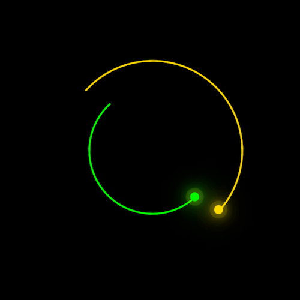

**链接 :** [github](https://shanyuhai123.github.io/learnCSS/0025-comet-rotating-loader/)

### 0026. Set off paper button effects

**原文链接 :** [github](https://github.com/comehope/front-end-daily-challenges/tree/master/026-set-off-paper-button-effects)

**介绍 :**  按钮被从纸上掀起的立体效果

**效果 :**

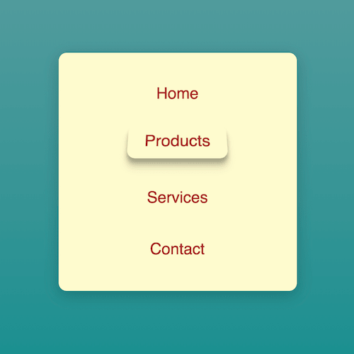

**链接 :** [github](https://shanyuhai123.github.io/learnCSS/0026-set-off-paper-button-effects/)

### 0027. Rainbow loader

**原文链接 :** [github](https://github.com/comehope/front-end-daily-challenges/tree/master/027-rainbow-loader)

**介绍 :**  精彩的彩虹 loading 特效

**效果 :**

**链接 :** [github](https://shanyuhai123.github.io/learnCSS/0027-rainbow-loader/)

### 0028. Penrose triangle

**原文链接 :** [github](https://github.com/comehope/front-end-daily-challenges/tree/master/028-penrose-triangle)

**介绍 :**  世界上不存在的彭罗斯三角形

**效果 :**

**链接 :** [github](https://shanyuhai123.github.io/learnCSS/0028-penrose-triangle/)

### 0029. Marquee slash animation

**原文链接 :** [github](https://github.com/comehope/front-end-daily-challenges/tree/master/029-marquee-slash-animation)

**介绍 :**  如何不用 transition 和 animation 也能做网页动画

**效果 :**

**链接 :** [github](https://shanyuhai123.github.io/learnCSS/0029-marquee-slash-animation/)

### 0030. Swinging signboard effects

**原文链接 :** [github](https://github.com/comehope/front-end-daily-challenges/tree/master/030-swinging-signboard-effects)

**介绍 :**  晃动的公告板

**效果 :**

**链接 :** [github](https://shanyuhai123.github.io/learnCSS/0030-swinging-signboard-effects/)

### 0031. Minimalist ping pong animation

**原文链接 :** [github](https://github.com/comehope/front-end-daily-challenges/tree/master/031-minimalist-ping-pong-animation)

**介绍 :**  乒乓球对打动画

**效果 :**

**链接 :** [github](https://shanyuhai123.github.io/learnCSS/0031-minimalist-ping-pong-animation/)

### 0032. Hexagonal button effects

**原文链接 :** [github](https://github.com/comehope/front-end-daily-challenges/tree/master/032-hexagonal-button-effects)

**介绍 :**  六边形按钮特效

**效果 :**

**链接 :** [github](https://shanyuhai123.github.io/learnCSS/0032-hexagonal-button-effects/)

### 0033. Milk text effect

**原文链接 :** [github](https://github.com/comehope/front-end-daily-challenges/tree/master/033-milk-text-effect)

**介绍 :**  牛奶文字变换效果

**效果 :**

**链接 :** [github](https://shanyuhai123.github.io/learnCSS/0033-milk-text-effect/)

### 0034. Box border stacking effect

**原文链接 :** [github](https://github.com/comehope/front-end-daily-challenges/tree/master/034-box-border-stacking-effect)

**介绍 :**  文本前后穿梭的边框

**效果 :**

**链接 :** [github](https://shanyuhai123.github.io/learnCSS/0034-box-border-stacking-effect/)

### 0035. Panda

**原文链接 :** [github](https://github.com/comehope/front-end-daily-challenges/tree/master/035-panda)

**介绍 :**  只用一个 DOM 元素就能画出国宝熊猫

**效果 :**

**链接 :** [github](https://shanyuhai123.github.io/learnCSS/0035-panda/)

### 0036. Solar eclipse

**原文链接 :** [github](https://github.com/comehope/front-end-daily-challenges/tree/master/036-solar-eclipse)

**介绍 :**  在页面上表现日蚀现象

**效果 :**

**链接 :** [github](https://shanyuhai123.github.io/learnCSS/0036-solar-eclipse/)

### 0037. Stroke animation button effect

**原文链接 :** [github](https://github.com/comehope/front-end-daily-challenges/tree/master/037-stroke-animation-button-effect)

**介绍 :**  描边按钮特效

**效果 :**

**链接 :** [github](https://shanyuhai123.github.io/learnCSS/0037-stroke-animation-button-effect/)

### 0038. Stairs lettering effect

**原文链接 :** [github](https://github.com/comehope/front-end-daily-challenges/tree/master/038-stairs-lettering-effect)

**介绍 :**  阶梯文字特效

**效果 :**

**链接 :** [github](https://shanyuhai123.github.io/learnCSS/0038-stairs-lettering-effect/)

### 0039. Stripe rainbow heart

**原文链接 :** [github](https://github.com/comehope/front-end-daily-challenges/tree/master/039-stripe-rainbow-heart)

**介绍 :**  怀念童年心情的条纹彩虹心特效

**效果 :**

**链接 :** [github](https://shanyuhai123.github.io/learnCSS/0039-stripe-rainbow-heart/)

### 0040. Notebook page flip animation

**原文链接 :** [github](https://github.com/comehope/front-end-daily-challenges/tree/master/040-notebook-page-flip-animation)

**介绍 :**  记事本翻页动画

**效果 :**

**链接 :** [github](https://shanyuhai123.github.io/learnCSS/0040-notebook-page-flip-animation/)

### 0041. Pencil

**原文链接 :** [github](https://github.com/comehope/front-end-daily-challenges/tree/master/041-pencil)

**介绍 :**  栩栩如生的铅笔

**效果 :**

**链接 :** [github](https://shanyuhai123.github.io/learnCSS/0041-pencil/)

### 0042. Equalizer loader

**原文链接 :** [github](https://github.com/comehope/front-end-daily-challenges/tree/master/042-equalizer-loader)

**介绍 :**  均衡器 loader 动画

**效果 :**

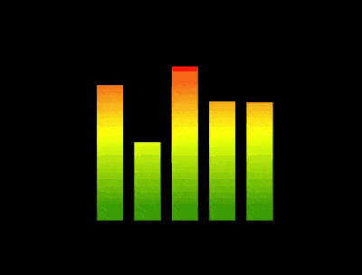

**链接 :** [github](https://shanyuhai123.github.io/learnCSS/0042-equalizer-loader/)

### 0043. Vue logo

**原文链接 :** [github](https://github.com/comehope/front-end-daily-challenges/tree/master/043-vue-logo)

**介绍 :**  绘制一个充满动感的 Vue logo

**效果 :**

**链接 :** [github](https://shanyuhai123.github.io/learnCSS/0043-vue-logo/)

### 0044. Background transition button effect

**原文链接 :** [github](https://github.com/comehope/front-end-daily-challenges/tree/master/044-background-transition-button-effect)

**介绍 :**  背景色块变换的按钮特效

**效果 :**

**链接 :** [github](https://shanyuhai123.github.io/learnCSS/0044-background-transition-button-effect/)

### 0045. Colorful rhombus loader

**原文链接 :** [github](https://github.com/comehope/front-end-daily-challenges/tree/master/045-colorful-rhombus-loader)

**介绍 :**  菱形 loader 动画

**效果 :**

**链接 :** [github](https://shanyuhai123.github.io/learnCSS/0045-colorful-rhombus-loader/)

### 0046. Bounced ball effect

**原文链接 :** [github](https://github.com/comehope/front-end-daily-challenges/tree/master/046-bounced-ball-effect)

**介绍 :**  在容器中反弹的小球

**效果 :**

**链接 :** [github](https://shanyuhai123.github.io/learnCSS/0046-bounced-ball-effect/)

### 0047. Butterfly specimen

**原文链接 :** [github](https://github.com/comehope/front-end-daily-challenges/tree/master/047-butterfly-specimen)

**介绍 :**  蝴蝶标本展示框

**效果 :**

**链接 :** [github](https://shanyuhai123.github.io/learnCSS/0047-butterfly-specimen/)

### 0048. Mosquito coil

**原文链接 :** [github](https://github.com/comehope/front-end-daily-challenges/tree/master/048-mosquito-coil)

**介绍 :**  一盘传统蚊香

**效果 :**

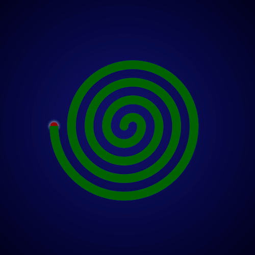

**链接 :** [github](https://shanyuhai123.github.io/learnCSS/0048-mosquito-coil/)

### 0049. Ice lolly

**原文链接 :** [github](https://github.com/comehope/front-end-daily-challenges/tree/master/049-ice-lolly)

**介绍 :**  诱人的冰棍

**效果 :**

**链接 :** [github](https://shanyuhai123.github.io/learnCSS/0049-ice-lolly/)

### 0050. Newton's cradle

**原文链接 :** [github](https://github.com/comehope/front-end-daily-challenges/tree/master/050-newtons-cradle)

**介绍 :**  永动的牛顿摆

**效果 :**

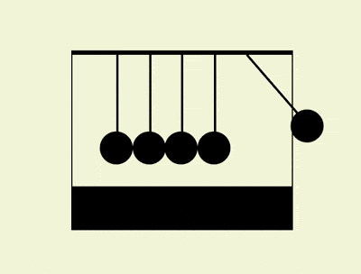

**链接 :** [github](https://shanyuhai123.github.io/learnCSS/0050-newtons-cradle/)

### 0051. Radar scanning

**原文链接 :** [github](https://github.com/comehope/front-end-daily-challenges/tree/master/051-radar-scanning)

**介绍 :**  雷达扫描动画

**效果 :**

**链接 :** [github](https://shanyuhai123.github.io/learnCSS/0051-radar-scanning/)

### 0052. Ring and spheres animation

**原文链接 :** [github](https://github.com/comehope/front-end-daily-challenges/tree/master/052-ring-and-spheres-animation)

**介绍 :**  小球绕着圆环盘旋的动画

**效果 :**

 

**链接 :** [github](https://shanyuhai123.github.io/learnCSS/0052-ring-and-spheres-animation/)

### 0053. Text fade loader

**原文链接 :** [github](https://github.com/comehope/front-end-daily-challenges/tree/master/053-text-fade-loader)

**介绍 :**  文本淡入淡出的 loader 动画

**效果 :**

 

**链接 :** [github](https://shanyuhai123.github.io/learnCSS/0053-text-fade-loader/)

### 0054. Chessboard

**原文链接 :** [github](https://github.com/comehope/front-end-daily-challenges/tree/master/054-chessboard)

**介绍 :**  国际象棋

**效果 :**

 

**链接 :** [github](https://shanyuhai123.github.io/learnCSS/0054-chessboard/)

### 0055. Sun, Earth and Moon Model

**原文链接 :** [github](https://github.com/comehope/front-end-daily-challenges/tree/master/055-sun-earth-and-moon-model)

**介绍 :**  太阳、地球、月亮的运转模型

**效果 :**

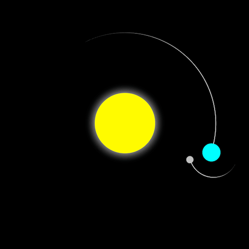 

**链接 :** [github](https://shanyuhai123.github.io/learnCSS/0055-sun-earth-and-moon-model/)

### 0056. A programmer's life

**原文链接 :** [github](https://github.com/comehope/front-end-daily-challenges/tree/master/056-a-programmers-life)

**介绍 :**  程序员的生活

**效果 :**

 

**链接 :** [github](https://shanyuhai123.github.io/learnCSS/0056-a-programmers-life/)

### 0057. Eyes in the dark

**原文链接 :** [github](https://github.com/comehope/front-end-daily-challenges/tree/master/057-eyes-in-the-dark)

**介绍 :**  黑暗中的眼睛

**效果 :**

 

**链接 :** [github](https://shanyuhai123.github.io/learnCSS/0057-eyes-in-the-dark/)

### 0058. Parrot

**原文链接 :** [github](https://github.com/comehope/front-end-daily-challenges/tree/master/058-parrot)

**介绍 :**  卡通鹦鹉

**效果 :**

 

**链接 :** [github](https://shanyuhai123.github.io/learnCSS/0058-parrot/)

### 0059. Rainbow background text

**原文链接 :** [github](https://github.com/comehope/front-end-daily-challenges/tree/master/059-rainbow-background-text)

**介绍 :**  彩虹背景文字

**效果 :**

 

**链接 :** [github](https://shanyuhai123.github.io/learnCSS/0059-rainbow-background-text/)

### 0060. Lego brick

**原文链接 :** [github](https://github.com/comehope/front-end-daily-challenges/tree/master/060-lego-brick)

**介绍 :**  乐高积木

**效果 :**

 

**链接 :** [github](https://shanyuhai123.github.io/learnCSS/0060-lego-brick/)

### 0061. Coffee pot

**原文链接 :** [github](https://github.com/comehope/front-end-daily-challenges/tree/master/061-coffee-pot)

**介绍 :**  咖啡壶

**效果 :**

 

**链接 :** [github](https://shanyuhai123.github.io/learnCSS/0061-coffee-pot/)

### 0062. Steamer

**原文链接 :** [github](https://github.com/comehope/front-end-daily-challenges/tree/master/062-steamer)

**介绍 :**  蒸锅

**效果 :**

 

**链接 :** [github](https://shanyuhai123.github.io/learnCSS/0062-steamer/)

### 0063. Toaster

**原文链接 :** [github](https://github.com/comehope/front-end-daily-challenges/tree/master/063-toaster)

**介绍 :**  烤面包机

**效果 :**

 

**链接 :** [github](https://shanyuhai123.github.io/learnCSS/0063-toaster/)

### 0064. Soccer field

**原文链接 :** [github](https://github.com/comehope/front-end-daily-challenges/tree/master/064-soccer-field)

**介绍 :**  足球场

**效果 :**

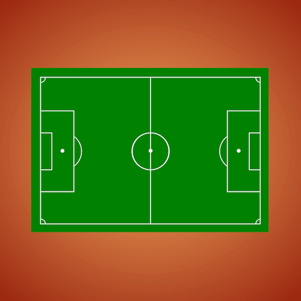 

**链接 :** [github](https://shanyuhai123.github.io/learnCSS/0064-soccer-field/)

### 0065. Swaying loader

**原文链接 :** [github](https://github.com/comehope/front-end-daily-challenges/tree/master/065-swaying-loader)

**介绍 :**  摇摇晃晃的 loader

**效果 :**

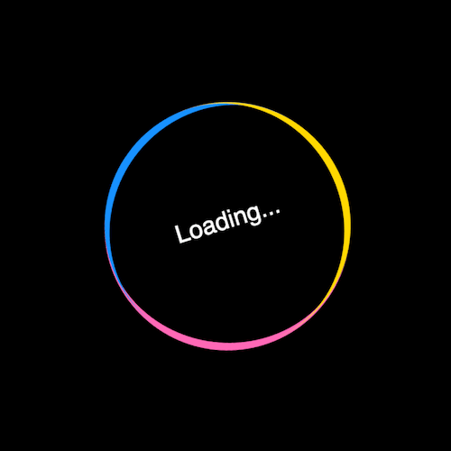 

**链接 :** [github](https://shanyuhai123.github.io/learnCSS/0065-swaying-loader/)

### 0066. Coffee machine

**原文链接 :** [github](https://github.com/comehope/front-end-daily-challenges/tree/master/066-coffee-machine)

**介绍 :**  咖啡机

**效果 :**

 

**链接 :** [github](https://shanyuhai123.github.io/learnCSS/0066-coffee-machine/)

### 0067. Lattice dots loader

**原文链接 :** [github](https://github.com/comehope/front-end-daily-challenges/tree/master/067-lattice-dots-loader)

**介绍 :**  单元素点阵 loader

**效果 :**

 

**链接 :** [github](https://shanyuhai123.github.io/learnCSS/0067-lattice-dots-loader/)

### 0068. Color cards

**原文链接 :** [github](https://github.com/comehope/front-end-daily-challenges/tree/master/068-color-cards)

**介绍 :**  色卡

**效果 :**

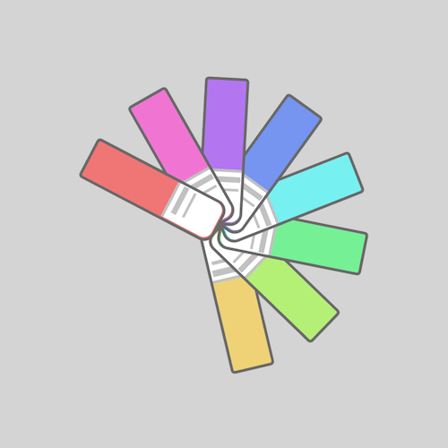 

**链接 :** [github](https://shanyuhai123.github.io/learnCSS/0068-color-cards/)

### 0069. Throw the box

**原文链接 :** [github](https://github.com/comehope/front-end-daily-challenges/tree/master/069-throw-the-box)

**介绍 :**  单元素抛盒子的 loader

**效果 :**

 

**链接 :** [github](https://shanyuhai123.github.io/learnCSS/0069-throw-the-box/)

### 0070. Wandered jelly monster

**原文链接 :** [github](https://github.com/comehope/front-end-daily-challenges/tree/master/070-wandered-jelly-monster)

**介绍 :**  徘徊的果冻怪兽

**效果 :**

 

**链接 :** [github](https://shanyuhai123.github.io/learnCSS/0070-wandered-jelly-monster/)

### 0071. 8-shaped dancing loader

**原文链接 :** [github](https://github.com/comehope/front-end-daily-challenges/tree/master/071-8-shaped-dancing-loader)

**介绍 :**  跳 8 字型舞的 loader

**效果 :**

 

**链接 :** [github](https://shanyuhai123.github.io/learnCSS/0071-8-shaped-dancing-loader/)

### 0072. Bubble coloring button

**原文链接 :** [github](https://github.com/comehope/front-end-daily-challenges/tree/master/072-bubble-coloring-button)

**介绍 :**  气泡填色的按钮特效

**效果 :**

 

**链接 :** [github](https://shanyuhai123.github.io/learnCSS/0072-bubble-coloring-button/)

### 0073. Fox

**原文链接 :** [github](https://github.com/comehope/front-end-daily-challenges/tree/master/073-fox)

**介绍 :**  卡通狐狸

**效果 :**

 

**链接 :** [github](https://shanyuhai123.github.io/learnCSS/0073-fox/)

### 0074. MacBook Pro

**原文链接 :** [github](https://github.com/comehope/front-end-daily-challenges/tree/master/074-macbook-pro)

**介绍 :**  一台 MacBook Pro

**效果 :**

 

**链接 :** [github](https://shanyuhai123.github.io/learnCSS/0074-macbook-pro/)

### 0075. Candle

**原文链接 :** [github](https://github.com/comehope/front-end-daily-challenges/tree/master/075-candle)

**介绍 :**  摇曳着烛光的蜡烛

**效果 :**

 

**链接 :** [github](https://shanyuhai123.github.io/learnCSS/0075-candle/)

### 0076. Hey, Take it easy!

**原文链接 :** [github](https://github.com/comehope/front-end-daily-challenges/tree/master/076-hey-take-it-easy)

**介绍 :**  一组单元素办公用品

**效果 :**

 

**链接 :** [github](https://shanyuhai123.github.io/learnCSS/0076-hey-take-it-easy/)

### 0077. Wavy flag

**原文链接 :** [github](https://github.com/comehope/front-end-daily-challenges/tree/master/077-wavy-flag)

**介绍 :**  旗帜飘扬的动画

**效果 :**

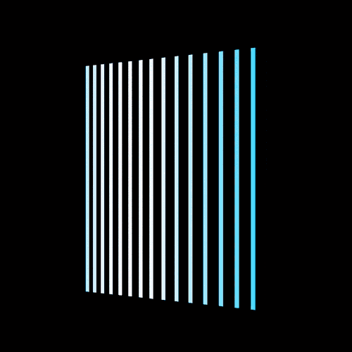 

**链接 :** [github](https://shanyuhai123.github.io/learnCSS/0077-wavy-flag/)

### 0078. Windows boot screen

**原文链接 :** [github](https://github.com/comehope/front-end-daily-challenges/tree/master/078-windows-boot-screen)

**介绍 :**  Windows 启动界面

**效果 :**

 

**链接 :** [github](https://shanyuhai123.github.io/learnCSS/0078-windows-boot-screen/)

### 0079. McDonald's logo

**原文链接 :** [github](https://github.com/comehope/front-end-daily-challenges/tree/master/079-mcdonalds)

**介绍 :**  单元素麦当劳金拱门 Logo

**效果 :**

 

**链接 :** [github](https://shanyuhai123.github.io/learnCSS/0079-mcdonalds/)

### 0080. Bicycle wheel

**原文链接 :** [github](https://github.com/comehope/front-end-daily-challenges/tree/master/080-bicycle-wheel)

**介绍 :**  自行车车轮

**效果 :**

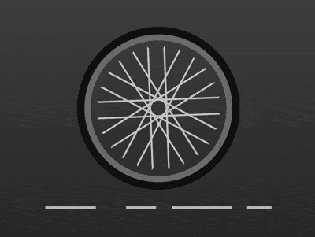 

**链接 :** [github](https://shanyuhai123.github.io/learnCSS/0080-bicycle-wheel/)

### 0081. Swapping colors rotating animation

**原文链接 :** [github](https://github.com/comehope/front-end-daily-challenges/tree/master/081-swapping-colors-rotating-animation)

**介绍 :**  变色旋转动画

**效果 :**

 

**链接 :** [github](https://shanyuhai123.github.io/learnCSS/0081-swapping-colors-rotating-animation/)

### 0082. Bouncing letter i

**原文链接 :** [github](https://github.com/comehope/front-end-daily-challenges/tree/master/082-bouncing-letter-i)

**介绍 :**  跳动的字母 i

**效果 :**

 

**链接 :** [github](https://shanyuhai123.github.io/learnCSS/0082-bouncing-letter-i/)

### 0083. A ball climbing the stairs

**原文链接 :** [github](https://github.com/comehope/front-end-daily-challenges/tree/master/083-a-ball-climbing-the-stairs)

**介绍 :**  小球上台阶的动画

**效果 :**

 

**链接 :** [github](https://shanyuhai123.github.io/learnCSS/0083-a-ball-climbing-the-stairs/)

### 0084. Need for speed loader

**原文链接 :** [github](https://github.com/comehope/front-end-daily-challenges/tree/master/084-need-for-speed-loader)

**介绍 :**  极品飞车 loader

**效果 :**

 

**链接 :** [github](https://shanyuhai123.github.io/learnCSS/0084-need-for-speed-loader/)

### 0085. Bouncing ball

**原文链接 :** [github](https://github.com/comehope/front-end-daily-challenges/tree/master/085-bouncing-ball)

**介绍 :**  小球反弹的动画

**效果 :**

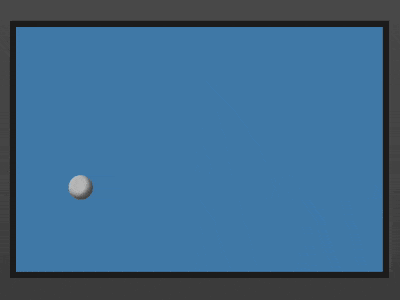 

**链接 :** [github](https://shanyuhai123.github.io/learnCSS/0085-bouncing-ball/)

### 0086. Rotating squares

**原文链接 :** [github](https://github.com/comehope/front-end-daily-challenges/tree/master/086-rotating-squares)

**介绍 :**  方块旋转动画

**效果 :**

 

**链接 :** [github](https://shanyuhai123.github.io/learnCSS/0086-rotating-squares/)

### 0087. Refrigerator

**原文链接 :** [github](https://github.com/comehope/front-end-daily-challenges/tree/master/087-refrigerator)

**介绍 :**  用 1 个 DOM 元素和纯 CSS 创作一台对开门冰箱

**效果 :**

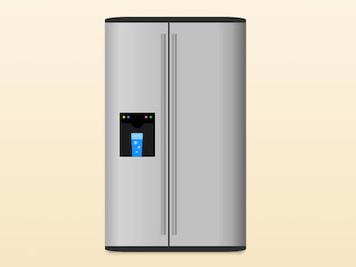 

**链接 :** [github](https://shanyuhai123.github.io/learnCSS/0087-refrigerator/)

### 0088. Burning Flame

**原文链接 :** [github](https://github.com/comehope/front-end-daily-challenges/tree/master/088-burning-flame)

**介绍 :**  火焰动画

**效果 :**

 

**链接 :** [github](https://shanyuhai123.github.io/learnCSS/0088-burning-flame/)

### 0089. Spiral arms particles animation

**原文链接 :** [github](https://github.com/comehope/front-end-daily-challenges/tree/master/089-spiral-arms-particles-animation)

**介绍 :**  旋臂粒子动画

**效果 :**

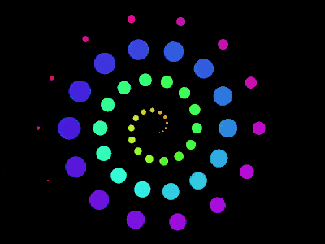 

**链接 :** [github](https://shanyuhai123.github.io/learnCSS/0089-spiral-arms-particles-animation/)

### 0090. Endless hexagonal space

**原文链接 :** [github](https://github.com/comehope/front-end-daily-challenges/tree/master/090-endless-hexagonal-space)

**介绍 :**  无尽的六边形空间

**效果 :**

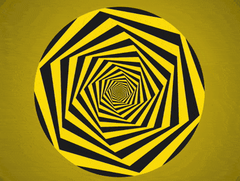 

**链接 :** [github](https://shanyuhai123.github.io/learnCSS/0090-endless-hexagonal-space/)

### 0091. Train loader

**原文链接 :** [github](https://github.com/comehope/front-end-daily-challenges/tree/master/091-train-loader)

**介绍 :**  行驶中的火车 loader

**效果 :**

 

**链接 :** [github](https://shanyuhai123.github.io/learnCSS/0091-train-loader/)

### 0092. Saturn

**原文链接 :** [github](https://github.com/comehope/front-end-daily-challenges/tree/master/092-saturn)

**介绍 :**  逼真的土星

**效果 :**

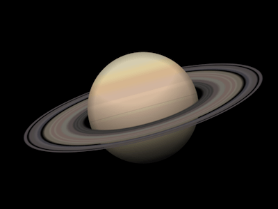 

**链接 :** [github](https://shanyuhai123.github.io/learnCSS/0092-saturn/)

### 0093. Lightning cable

**原文链接 :** [github](https://github.com/comehope/front-end-daily-challenges/tree/master/093-lightning-cable)

**介绍 :**  充电连接线

**效果 :**

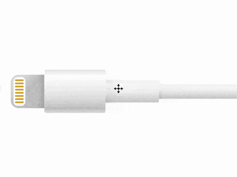 

**链接 :** [github](https://shanyuhai123.github.io/learnCSS/0093-lightning-cable/)

### 0094. Polaroid camera

**原文链接 :** [github](https://github.com/comehope/front-end-daily-challenges/tree/master/094-polaroid-camera)

**介绍 :**  拍立得照相机

**效果 :**

 

**链接 :** [github](https://shanyuhai123.github.io/learnCSS/0094-polaroid-camera/)

### 0095. Rotating worm

**原文链接 :** [github](https://github.com/comehope/front-end-daily-challenges/tree/master/095-rotating-worm)

**介绍 :**  扭动的蠕虫

**效果 :**

 

**链接 :** [github](https://shanyuhai123.github.io/learnCSS/0095-rotating-worm/)

### 0096. Spacecraft

**原文链接 :** [github](https://github.com/comehope/front-end-daily-challenges/tree/master/096-spacecraft)

**介绍 :**  遨游太空的宇宙飞船

**效果 :**

 

**链接 :** [github](https://shanyuhai123.github.io/learnCSS/0096-spacecraft/)

### 0097. Swagger dots

**原文链接 :** [github](https://github.com/comehope/front-end-daily-challenges/tree/master/097-swagger-dots)

**介绍 :**  昂首阔步的圆点

**效果 :**

 

**链接 :** [github](https://shanyuhai123.github.io/learnCSS/0097-swagger-dots/)

### 0098. Pig in angry birds

**原文链接 :** [github](https://github.com/comehope/front-end-daily-challenges/tree/master/098-pig-in-angry-birds)

**介绍 :**  愤怒小鸟中的绿猪

**效果 :**

 

**链接 :** [github](https://shanyuhai123.github.io/learnCSS/0098-pig-in-angry-birds/)

### 0099. Roller coaster loader

**原文链接 :** [github](https://github.com/comehope/front-end-daily-challenges/tree/master/099-roller-coaster-loader)

**介绍 :**  过山车 loader

**效果 :**

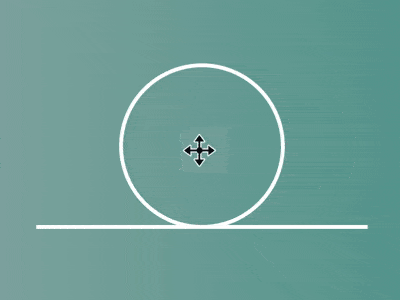 

**链接 :** [github](https://shanyuhai123.github.io/learnCSS/0099-roller-coaster-loader/)

### 0100. Shimmering neon text

**原文链接 :** [github](https://github.com/comehope/front-end-daily-challenges/tree/master/100-shimmering-neon-text)

**介绍 :**  闪闪发光的霓虹灯文字

**效果 :**

 

**链接 :** [github](https://shanyuhai123.github.io/learnCSS/0100-shimmering-neon-text/)

### 0101. Pendulums

**原文链接 :** [github](https://github.com/comehope/front-end-daily-challenges/tree/master/101-pendulums)

**介绍 :**  一组摆线

**效果 :**

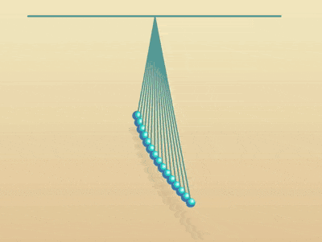 

**链接 :** [github](https://shanyuhai123.github.io/learnCSS/0101-pendulums/)

### 0102. Little buddha

**原文链接 :** [github](https://github.com/comehope/front-end-daily-challenges/tree/master/102-little-buddha)

**介绍 :**  小和尚

**效果 :**

 

**链接 :** [github](https://shanyuhai123.github.io/learnCSS/0102-little-buddha/)

### 0103. Surveillance eye

**原文链接 :** [github](https://github.com/comehope/front-end-daily-challenges/tree/master/103-surveillance-eye)

**介绍 :**  监视眼

**效果 :**

 

**链接 :** [github](https://shanyuhai123.github.io/learnCSS/0103-surveillance-eye/)

### 0104. Truck loader

**原文链接 :** [github](https://github.com/comehope/front-end-daily-challenges/tree/master/104-truck-loader)

**介绍 :**  货车 loader

**效果 :**

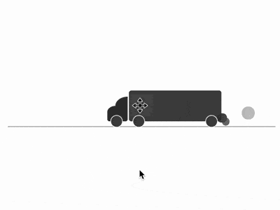 

**链接 :** [github](https://shanyuhai123.github.io/learnCSS/0104-truck-loader/)

### 0105. Moon rabbit

**原文链接 :** [github](https://github.com/comehope/front-end-daily-challenges/tree/master/105-moon-rabbit)

**介绍 :**  玉免

**效果 :**

 

**链接 :** [github](https://shanyuhai123.github.io/learnCSS/0105-moon-rabbit/)

### 0106. Animation with no dom

**原文链接 :** [github](https://github.com/comehope/front-end-daily-challenges/tree/master/106-animation-with-no-dom)

**介绍 :**  没有 DOM 元素的动画

**效果 :**

 

**链接 :** [github](https://shanyuhai123.github.io/learnCSS/0106-animation-with-no-dom/)

### 0107. Monocular monster

**原文链接 :** [github](https://github.com/comehope/front-end-daily-challenges/tree/master/107-monocular-monster)

**介绍 :**  单眼怪兽

**效果 :**

 

**链接 :** [github](https://shanyuhai123.github.io/learnCSS/0107-monocular-monster/)

### 0108. Black and white overlap animation

**原文链接 :** [github](https://github.com/comehope/front-end-daily-challenges/tree/master/108-black-and-white-overlap-animation)

**介绍 :**  抽象的黑白交叠动画

**效果 :**

 

**链接 :** [github](https://shanyuhai123.github.io/learnCSS/0108-black-and-white-overlap-animation/)

### 0109. Say "LOVE" in different languages

**原文链接 :** [github](https://github.com/comehope/front-end-daily-challenges/tree/master/109-say-love-in-different-languages)

**介绍 :**  用文字组成的心形图案

**效果 :**

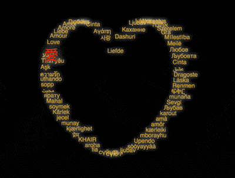 

**链接 :** [github](https://shanyuhai123.github.io/learnCSS/0109-say-love-in-different-languages/)

### 0110. Black bomb in angry birds

**原文链接 :** [github](https://github.com/comehope/front-end-daily-challenges/tree/master/110-black-bomb-in-angry-birds)

**介绍 :**  愤怒小鸟中的黑炮

**效果 :**

 

**链接 :** [github](https://shanyuhai123.github.io/learnCSS/0110-black-bomb-in-angry-birds/)

### 0111. A simple duck

**原文链接 :** [github](https://github.com/comehope/front-end-daily-challenges/tree/master/111-a-simple-duck)

**介绍 :**  艺术的鸭子

**效果 :**

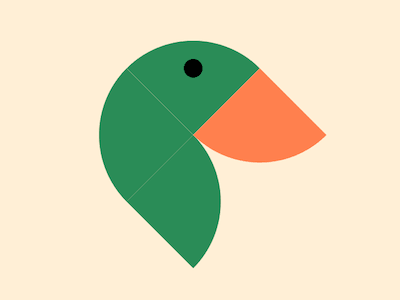 

**链接 :** [github](https://shanyuhai123.github.io/learnCSS/0111-a-simple-duck/)

### 0112. Button hover effect

**原文链接 :** [github](https://github.com/comehope/front-end-daily-challenges/tree/master/112-button-hover-effect)

**介绍 :**  切换背景的按钮悬停效果

**效果 :**

 

**链接 :** [github](https://shanyuhai123.github.io/learnCSS/0112-button-hover-effect/)

### 0113. Racing car loader

**原文链接 :** [github](https://github.com/comehope/front-end-daily-challenges/tree/master/113-racing-car-loader)

**介绍 :**  赛车 loader

**效果 :**

 

**链接 :** [github](https://shanyuhai123.github.io/learnCSS/0113-racing-car-loader/)

### 0114. Mix color loader

**原文链接 :** [github](https://github.com/comehope/front-end-daily-challenges/tree/master/114-mix-color-loader)

**介绍 :**  混色模式创作一个 loader 动画

**效果 :**

 

**链接 :** [github](https://shanyuhai123.github.io/learnCSS/0114-mix-color-loader/)

### 0115. Lights with π digits

**原文链接 :** [github](https://github.com/comehope/front-end-daily-challenges/tree/master/115-lights-with-pi-digits)

**介绍 :**  一组 π 数字的彩灯

**效果 :**

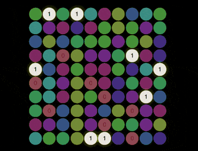 

**链接 :** [github](https://shanyuhai123.github.io/learnCSS/0115-lights-with-pi-digits/)

### 0116. Online/offline detector

**原文链接 :** [github](https://github.com/comehope/front-end-daily-challenges/tree/master/116-online-status-detector)

**介绍 :**  容用 VanillaJS 开发一个监控网络连接状态的页面

**效果 :**

 

**链接 :** [github](https://shanyuhai123.github.io/learnCSS/0116-online-status-detector/)

### 0117. Red anger in angry birds

**原文链接 :** [github](https://github.com/comehope/front-end-daily-challenges/tree/master/117-red-anger-in-angry-birds)

**介绍 :**  愤怒小鸟中的红火

**效果 :**

 

**链接 :** [github](https://shanyuhai123.github.io/learnCSS/0117-red-anger-in-angry-birds/)

### 0118. Hourglass loader

**原文链接 :** [github](https://github.com/comehope/front-end-daily-challenges/tree/master/118-hourglass-loader)

**介绍 :**  沙漏 loader

**效果 :**

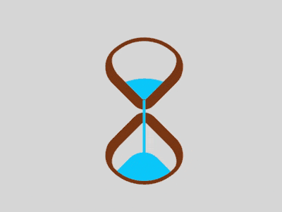 

**链接 :** [github](https://shanyuhai123.github.io/learnCSS/0118-hourglass-loader/)

### 0119. Draught beer

**原文链接 :** [github](https://github.com/comehope/front-end-daily-challenges/tree/master/119-draught-beer)

**介绍 :**  接扎啤的动画

**效果 :**

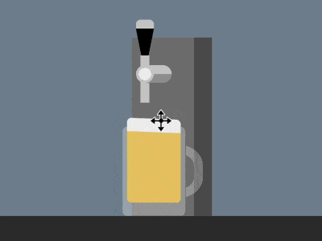 

**链接 :** [github](https://shanyuhai123.github.io/learnCSS/0119-draught-beer/)

### 0120. Tin foil cuted effect

**原文链接 :** [github](https://github.com/comehope/front-end-daily-challenges/tree/master/120-tin-foil-cuted-effect)

**介绍 :**  锡纸撕开的文字效果

**效果 :**

 

**链接 :** [github](https://shanyuhai123.github.io/learnCSS/0120-tin-foil-cuted-effect/)

### 0121. Fishes swimming

**原文链接 :** [github](https://github.com/comehope/front-end-daily-challenges/tree/master/121-fishes-swimming)

**介绍 :**  小鱼游动的交互动画

**效果 :**

 

**链接 :** [github](https://shanyuhai123.github.io/learnCSS/0121-fishes-swimming/)

### 0122. Apple photos icon

**原文链接 :** [github](https://github.com/comehope/front-end-daily-challenges/tree/master/122-apple-photos-icon)

**介绍 :**  苹果系统的相册图标

**效果 :**

 

**链接 :** [github](https://shanyuhai123.github.io/learnCSS/0122-apple-photos-icon/)

### 0123. Biplane

**原文链接 :** [github](https://github.com/comehope/front-end-daily-challenges/tree/master/123-biplane)

**介绍 :**  双冀飞机

**效果 :**

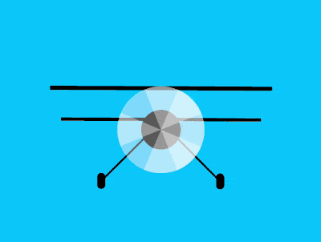 

**链接 :** [github](https://shanyuhai123.github.io/learnCSS/0123-biplane/)

### 0124. Origami cranes

**原文链接 :** [github](https://github.com/comehope/front-end-daily-challenges/tree/master/124-origami-cranes)

**介绍 :**  纸鹤

**效果 :**

 

**链接 :** [github](https://shanyuhai123.github.io/learnCSS/0124-origami-cranes/)

### 0125. A walking sad man

**原文链接 :** [github](https://github.com/comehope/front-end-daily-challenges/tree/master/125-a-walking-sad-man)

**介绍 :**  失落的人独自行走的动画

**效果 :**

 

**链接 :** [github](https://shanyuhai123.github.io/learnCSS/0125-a-walking-sad-man/)

### 0126. Button hover effect

**原文链接 :** [github](https://github.com/comehope/front-end-daily-challenges/tree/master/126-button-hover-effect)

**介绍 :**  小球变矩形背景的按钮悬停效果

**效果 :**

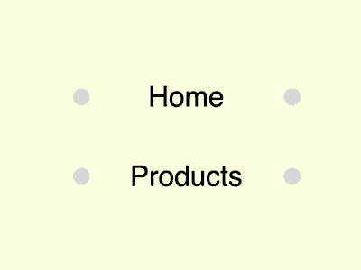 

**链接 :** [github](https://shanyuhai123.github.io/learnCSS/0126-button-hover-effect/)

### 0127. Circle illusion

**原文链接 :** [github](https://github.com/comehope/front-end-daily-challenges/tree/master/127-circle-illusion)

**介绍 :**  圆环旋转错觉动画

**效果 :**

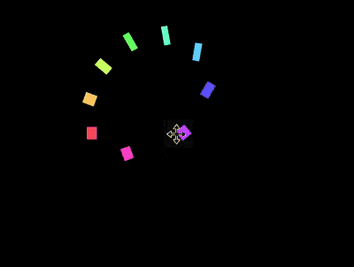 

**链接 :** [github](https://shanyuhai123.github.io/learnCSS/0127-circle-illusion/)

### 0128. The goddess is coming

**原文链接 :** [github](https://github.com/comehope/front-end-daily-challenges/tree/master/128-the-goddess-is-coming)

**介绍 :**  “女神来了，快让路”的动画

**效果 :**

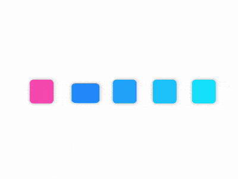 

**链接 :** [github](https://shanyuhai123.github.io/learnCSS/0128-the-goddess-is-coming/)

### 0129. Stripe illusion

**原文链接 :** [github](https://github.com/comehope/front-end-daily-challenges/tree/master/129-stripe-illusion)

**介绍 :**  条纹错觉动画

**效果 :**

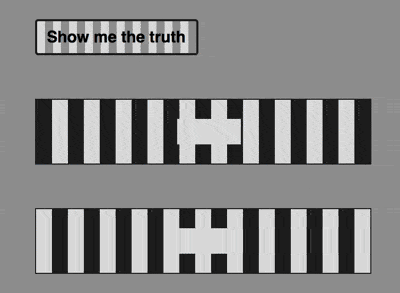 

**链接 :** [github](https://shanyuhai123.github.io/learnCSS/0129-stripe-illusion/)

### 0130. Google & googol

**原文链接 :** [github](https://github.com/comehope/front-end-daily-challenges/tree/master/130-google-googol)

**介绍 :**  Google & googol 信息图

**效果 :**

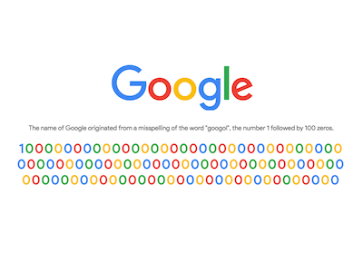 

**链接 :** [github](https://shanyuhai123.github.io/learnCSS/0130-google-googol/)

### 0131. Scissors

**原文链接 :** [github](https://github.com/comehope/front-end-daily-challenges/tree/master/131-scissors)

**介绍 :**  剪刀

**效果 :**

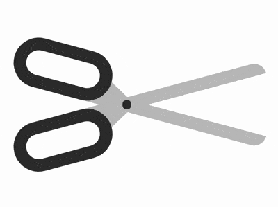 

**链接 :** [github](https://shanyuhai123.github.io/learnCSS/0131-scissors/)

### 0132. Thinking hand

**原文链接 :** [github](https://github.com/comehope/front-end-daily-challenges/tree/master/132-thinking-hand)

**介绍 :**  思考的手

**效果 :**

 

**链接 :** [github](https://shanyuhai123.github.io/learnCSS/0132-thinking-hand/)

### 0133. Continuous animation with GSAP

**原文链接 :** [github](https://github.com/comehope/front-end-daily-challenges/tree/master/133-continuous-animation-with-gsap)

**介绍 :**  用 CSS 和 GSAP 创作有多个关键帧的连续动画

**效果 :**

 

**链接 :** [github](https://shanyuhai123.github.io/learnCSS/0133-continuous-animation-with-gsap/)

### 0134. Sapling loader

**原文链接 :** [github](https://github.com/comehope/front-end-daily-challenges/tree/master/134-sapling-loader)

**介绍 :**  树枝发芽的 loader

**效果 :**

 

**链接 :** [github](https://shanyuhai123.github.io/learnCSS/0134-sapling-loader/)

### 0135. Button hover effect

**原文链接 :** [github](https://github.com/comehope/front-end-daily-challenges/tree/master/135-button-hover-effect)

**介绍 :**  悬停时右移的按钮特效

**效果 :**

 

**链接 :** [github](https://shanyuhai123.github.io/learnCSS/0135-button-hover-effect/)

### 0136. Colorful bar loader

**原文链接 :** [github](https://github.com/comehope/front-end-daily-challenges/tree/master/136-colorful-bar-loader)

**介绍 :**  用 D3 和 GSAP 创作一个横条 loader

**效果 :**

 

**链接 :** [github](https://shanyuhai123.github.io/learnCSS/0136-colorful-bar-loader/)

### 0137. Abstract water wave animation

**原文链接 :** [github](https://github.com/comehope/front-end-daily-challenges/tree/master/137-abstract-water-wave-animation)

**介绍 :**  抽象的水波荡漾的动画

**效果 :**

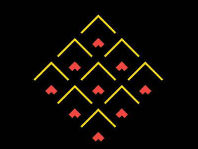 

**链接 :** [github](https://shanyuhai123.github.io/learnCSS/0137-abstract-water-wave-animation/)

### 0138. iPhone Price Comparison Chart

**原文链接 :** [github](https://github.com/comehope/front-end-daily-challenges/tree/master/138-iphone-price-comparison-chart)

**介绍 :**  iPhone 价格信息图

**效果 :**

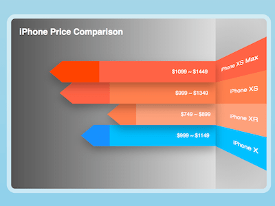 

**链接 :** [github](https://shanyuhai123.github.io/learnCSS/0138-iphone-price-comparison-chart/)

### 0139. Glowing particles animation

**原文链接 :** [github](https://github.com/comehope/front-end-daily-challenges/tree/master/139-glowing-particles-animation)

**介绍 :**  用 CSS 和 D3 创作光斑粒子交相辉映的动画

**效果 :**

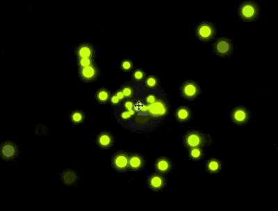 

**链接 :** [github](https://shanyuhai123.github.io/learnCSS/0139-glowing-particles-animation/)

### 0140. Text fade in effect

**原文链接 :** [github](https://github.com/comehope/front-end-daily-challenges/tree/master/140-text-fade-in-effect)

**介绍 :**  文本的淡入动画效果

**效果 :**

 

**链接 :** [github](https://shanyuhai123.github.io/learnCSS/0140-text-fade-in-effect/)

### 0141. Puppy stamp

**原文链接 :** [github](https://github.com/comehope/front-end-daily-challenges/tree/master/141-puppy-stamp)

**介绍 :**  小狗邮票

**效果 :**

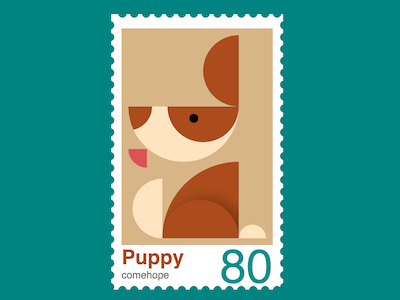 

**链接 :** [github](https://shanyuhai123.github.io/learnCSS/0141-puppy-stamp/)

### 0142. Rooster stamp

**原文链接 :** [github](https://github.com/comehope/front-end-daily-challenges/tree/master/142-rooster-stamp)

**介绍 :**  小鸡邮票

**效果 :**

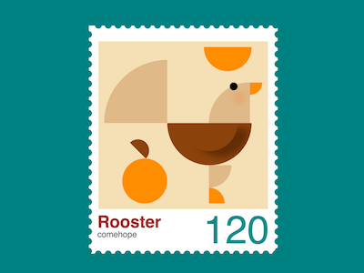 

**链接 :** [github](https://shanyuhai123.github.io/learnCSS/0142-rooster-stamp/)

### 0143. Squirrel stamp

**原文链接 :** [github](https://github.com/comehope/front-end-daily-challenges/tree/master/143-squirrel-stamp)

**介绍 :**  小松鼠邮票

**效果 :**

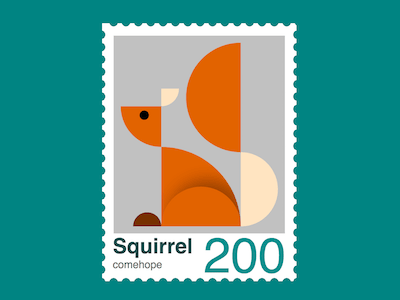 

**链接 :** [github](https://shanyuhai123.github.io/learnCSS/0143-squirrel-stamp/)

### 0144. Pattern animation

**原文链接 :** [github](https://github.com/comehope/front-end-daily-challenges/tree/master/144-pattern-animation)

**介绍 :**  用 D3 和 GSAP 创作一个集体舞动画

**效果 :**

 

**链接 :** [github](https://shanyuhai123.github.io/learnCSS/0144-pattern-animation/)

### 0145. Power switch

**原文链接 :** [github](https://github.com/comehope/front-end-daily-challenges/tree/master/145-power-switch)

**介绍 :**  电源开关控件

**效果 :**

 

**链接 :** [github](https://shanyuhai123.github.io/learnCSS/0145-power-switch/)

### 0146. Pulsation loader

**原文链接 :** [github](https://github.com/comehope/front-end-daily-challenges/tree/master/146-pulsation-loader)

**介绍 :**  脉动 loader

**效果 :**

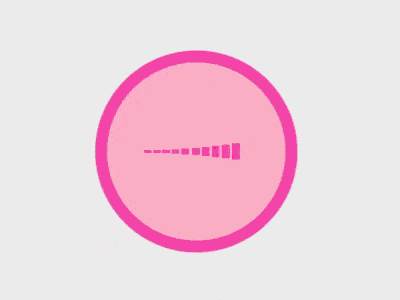 

**链接 :** [github](https://shanyuhai123.github.io/learnCSS/0146-pulsation-loader/)

### 0147. Perspective button hover effect

**原文链接 :** [github](https://github.com/comehope/front-end-daily-challenges/tree/master/147-perspective-button-hover-effect)

**介绍 :**  透视按钮的悬停特效

**效果 :**

 

**链接 :** [github](https://shanyuhai123.github.io/learnCSS/0147-perspective-button-hover-effect/)

### 0148. Button hover effect

**原文链接 :** [github](https://github.com/comehope/front-end-daily-challenges/tree/master/148-button-hover-effect)

**介绍 :**  从按钮两侧滑入装饰元素的悬停特效

**效果 :**

 

**链接 :** [github](https://shanyuhai123.github.io/learnCSS/0148-button-hover-effect/)

### 0149. Polo mints animation

**原文链接 :** [github](https://github.com/comehope/front-end-daily-challenges/tree/master/149-polo-mints-animation)

**介绍 :**  宝路薄荷糖的动画

**效果 :**

 

**链接 :** [github](https://shanyuhai123.github.io/learnCSS/0149-polo-mints-animation/)

### 0150. Pattern animation

**原文链接 :** [github](https://github.com/comehope/front-end-daily-challenges/tree/master/150-pattern-animation)

**介绍 :**  用 CSS 和 D3 创作一个集体舞动画

**效果 :**

 

**链接 :** [github](https://shanyuhai123.github.io/learnCSS/0150-pattern-animation/)

### 0151. Baymax

**原文链接 :** [github](https://github.com/comehope/front-end-daily-challenges/tree/master/151-baymax)

**介绍 :**  超能陆战队的大白

**效果 :**

 

**链接 :** [github](https://shanyuhai123.github.io/learnCSS/0151-baymax/)

### 0152. Black dots Illusion

**原文链接 :** [github](https://github.com/comehope/front-end-daily-challenges/tree/master/152-black-dots-illusion)

**介绍 :**  圆点错觉效果

**效果 :**

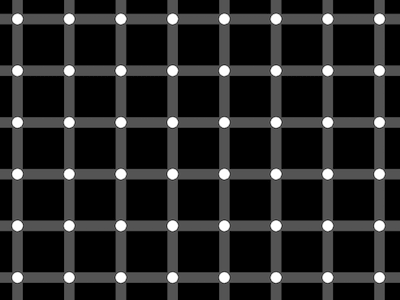 

**链接 :** [github](https://shanyuhai123.github.io/learnCSS/0152-black-dots-illusion/)

### 0153. Emoji tooltips

**原文链接 :** [github](https://github.com/comehope/front-end-daily-challenges/tree/master/153-emoji-tooltips)

**介绍 :**  用 CSS 和 VanillaJS 创作一组 tooltip 提示框

**效果 :**

**链接 :** [github](https://shanyuhai123.github.io/learnCSS/0153-emoji-tooltips/)

### 0154. Giddy animation

**原文链接 :** [github](https://github.com/comehope/front-end-daily-challenges/tree/master/154-giddy-animation)

**介绍 :**  眼冒金星的动画效果

**效果 :**

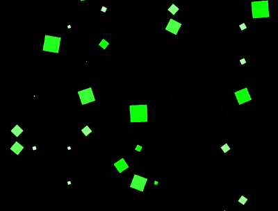

**链接 :** [github](https://shanyuhai123.github.io/learnCSS/0154-giddy-animation/)

### 0155. Balloon

**原文链接 :** [github](https://github.com/comehope/front-end-daily-challenges/tree/master/155-balloon)

**介绍 :**  热气球

**效果 :**

 

**链接 :** [github](https://shanyuhai123.github.io/learnCSS/0155-balloon/)

### 0156. Airplane window toggle

**原文链接 :** [github](https://github.com/comehope/front-end-daily-challenges/tree/master/156-airplane-window-toggle)

**介绍 :**  飞机舷窗风格的 toggle 控件

**效果 :**

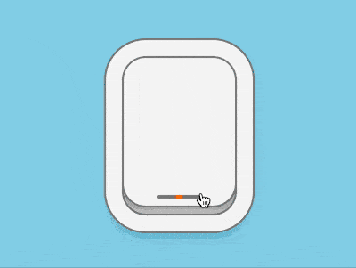 

**链接 :** [github](https://shanyuhai123.github.io/learnCSS/0156-airplane-window-toggle/)

### 0157. Chessboard illusion

**原文链接 :** [github](https://github.com/comehope/front-end-daily-challenges/tree/master/157-chessboard-illusion)

**介绍 :**  棋盘错觉动画

**效果 :**

**链接 :** [github](https://shanyuhai123.github.io/learnCSS/0157-chessboard-illusion/)

### 0158. Umbrella toggle

**原文链接 :** [github](https://github.com/comehope/front-end-daily-challenges/tree/master/158-umbrella-toggle)

**介绍 :**  雨伞 toggle 控件

**效果 :**

**链接 :** [github](https://shanyuhai123.github.io/learnCSS/0158-umbrella-toggle/)

### 0159. Halloween Switcher

**原文链接 :** [github](https://github.com/shanyuhai123/learnCSS/tree/master/0159-halloween-switcher)

**介绍 :**  容器厚条纹边框特效

**效果 :**

**链接 :** [github](https://shanyuhai123.github.io/learnCSS/0159-halloween-switcher/)

### 0160. Apple devices slide show

**原文链接 :** [github](https://github.com/comehope/front-end-daily-challenges/tree/master/159-apple-devices-slide-show)

**介绍 :**  苹果设备交互动画

**效果 :**

**链接 :** [github](https://shanyuhai123.github.io/learnCSS/0160-apple-devices-slide-show/)

### 0161. Opening popup animation

**原文链接 :** [github](https://github.com/comehope/front-end-daily-challenges/tree/master/160-opening-popup-animation)

**介绍 :**  内容弹窗的交互动画

**效果 :**

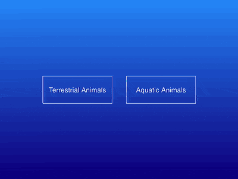

**链接 :** [github](https://shanyuhai123.github.io/learnCSS/0161-opening-popup-animation/)

### 0162. Chaplin

**原文链接 :** [github](https://github.com/comehope/front-end-daily-challenges/tree/master/161-chaplin)

**介绍 :**  卓别林

**效果 :**

**链接 :** [github](https://shanyuhai123.github.io/learnCSS/0162-chaplin/)

### 0163. Colorful Buttons

**原文链接 :** [github](https://github.com/shanyuhai123/learnCSS/tree/master/0163-colorful-button)

**介绍 :**  多彩的 Buttons

**效果 :**

**链接 :** [github](https://shanyuhai123.github.io/learnCSS/0163-colorful-button/)

### 016

**原文链接 :** github

**介绍 :**  容器厚条纹边框特效

**效果 :**

**链接 :** github